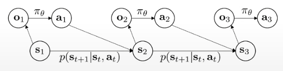
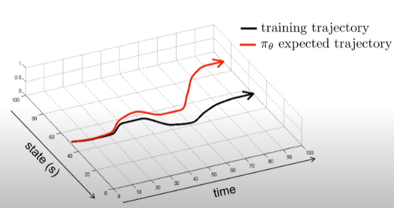
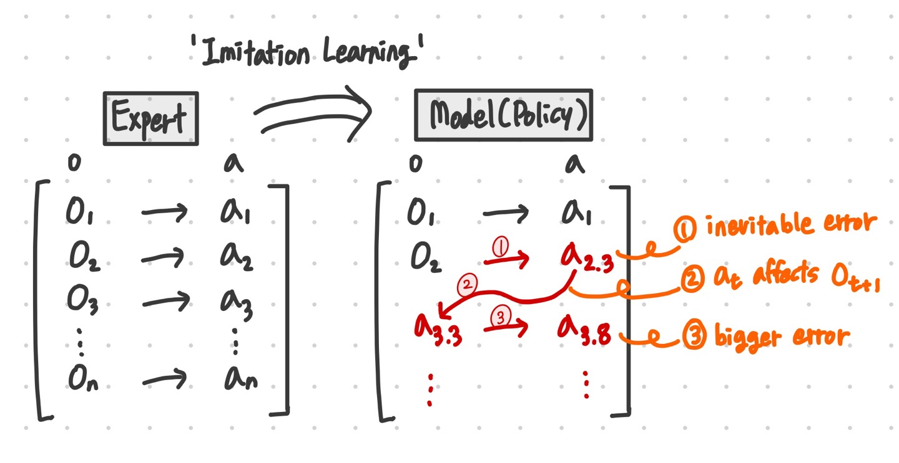
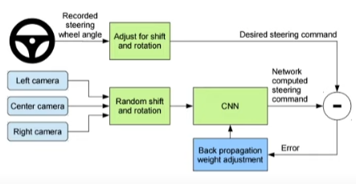
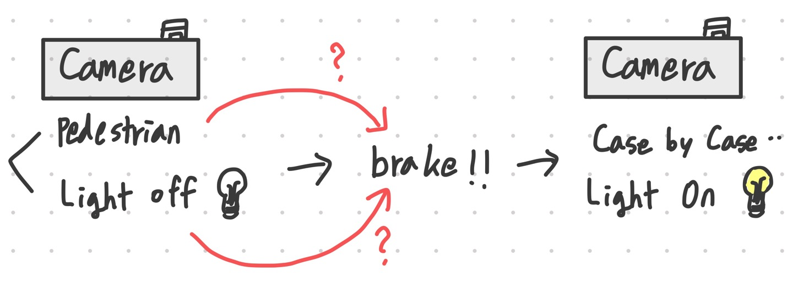
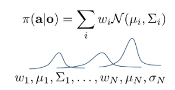
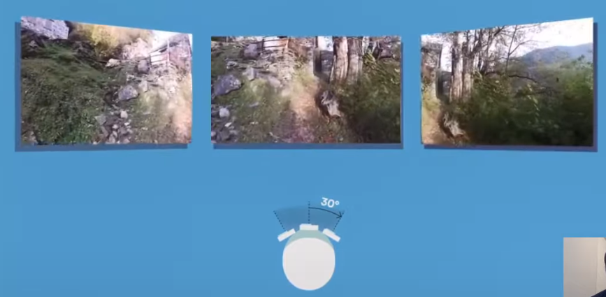
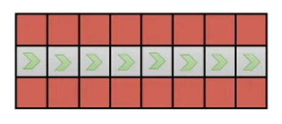
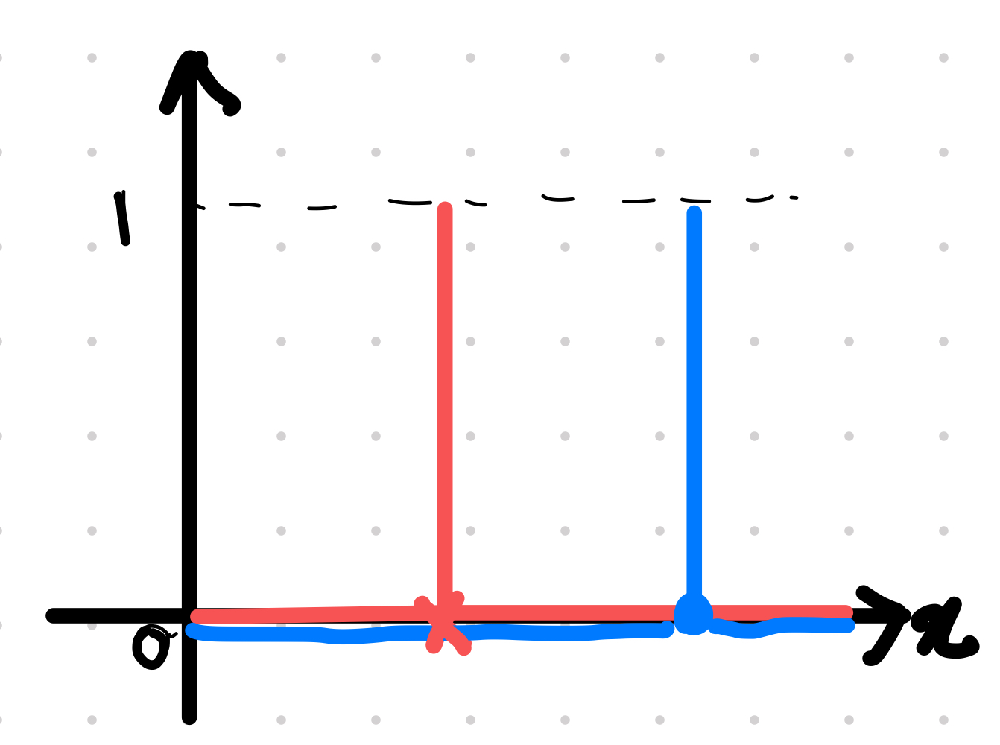
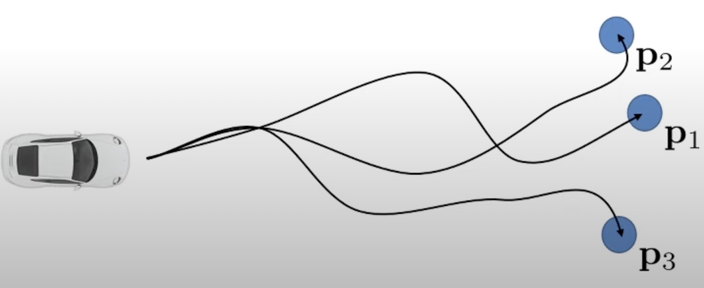

# Lec2

**# Lec2**

<h2><mark style='background-color: #ffdce0'>Part1</mark></h2>

<h3><mark style='background-color: #ffdce0'> - Supervised learning of Behaviors: Terminology & notation</mark></h3>

<h4> <mark style='background-color: #F7DDBE'>[Note] observation, state, policy, action 에 대한 용어 정의</mark></h4>

지도학습 용어부터 시작해보면 input 이미지가 있고 이를 neural network에 넣으면 label과 같은 output을 얻을 수 있다. 강화학습에서는 input o를 observation으로 부르고, output a를 action이라고 한다. 그리고 input과 output을 매핑시켜주는 모델 $\pi_\theta(a|o)$을 policy라고 부른다. 여기서 $\theta$는 policy의 parameter이고, neural net에서의 weight 개념과 일치한다. 모델은 주어진 o에 대한 a 분포를 나타낸다. 강화학습에서는 순차적 의사 결정 문제를 다룰 것이기에 매 time마다 input과 output이 발생한다. 그래서 time 정보을 표기하기 위해 time t를 사용한다. 
$o_t \rightarrow \pi_\theta(a_t|o_t) \rightarrow a_t$ 
  보통 강화학습에서는 discrete time 문제를 다루기 때문에 시간을 이산적인 step개념으로 표현한다. 또한 지도학습과 다르게 한 step의 output은 그 다음의 input에 영향을 미친다. 즉, $a_t$가 $o_{t+1}$에 영향을 미친다. 만약에 해당 step에서 호랑이를 인식하지 못했다면, 그 다음 step에서는 호랑이가 나에게 좀 더 가까이 접근하는 불상사가 발생할 수 도 있다. 이러한 기본 개념을 제어 문제의 policy를 학습하는데 확장해보자. 제어를 위해선 label이 아니라, action을 output으로 도출해야한다. 여기서 action이 이산적이라면 softmax distribution을 통해 호랑이를 만났을 때 취할 수 있는 action set중에서 하나를 고를 수 있다. 반대로, action이 continuous할 수 도 있는데 policy $\pi_\theta$가 continuous distribution의 parameter을 도출할 수 있다. 예를 들면, Multivariate Normal 또는 gaussian distribution 에서의 mean과 variance 말이다. 그리고 가끔 policy를 $\pi_\theta(a_t|s_t)$로 표현하는데, state는 보통 markovian state라고 가정하며, observation $o_t$는 그 state로부터의 결과이다. 그래서 보통은 $\pi_\theta(a_t|o_t)$ 이렇게 쓰지만, $\pi_\theta(a_t|s_t)$로 나타내기도 한다. 용어 총정리를 해보면 다음과 같다.
**Observation : $o_t$ |  state : $s_t$ |  Action : $a_t$  |  Policy : $\pi_\theta(a_t|o_t)$ or $\pi_\theta(a_t|s_t)$** 
  

 

<h3><mark style='background-color: #ffdce0'>- state vs observation</mark></h3>

<h4> <mark style='background-color: #F7DDBE'>[Note]observation은 state의 결과이다.</mark></h4>

state와 observation의 차이를 알아보기 위해 치타가 가젤을 쫒는 상황을 가정해보자. 해당 상황을 이미지로 담아보면 사진의 pixels은 치타와 가젤의 위치를 알아내기 충분할 수도 있고 아닐 수도 있다. 하지만 어떤 시스템(문제)이든 특정 시스템을 구성하기 위한 최소한의 표현인 state를 가지고 있다. 이미지 그 자체가 observation $o_t$라면, state는 시스템을 구성하는 표현으로 해당 시스템(문제)에서는 치타와 가젤의 위치, 그리고 그들의 속력이다. 그래서 observation에 따라 full state가 추론되지 못하는 경우도 있다. 예를 들어 자동차가 지나가서 치타가 가려진다면 그 이미지로 부터 치타의 위치를 알아낼 수 없다. 하지만 사실 치타는 이미지에서 가려져 이미지를 통해 그 state를 찾기 어려워진것일 뿐, 그대로의 위치에 존재할 것이기에 state는 변동이 없다. 즉, state는 특정 시스템의 구성을 의미하며, observation은 state를 추론하기에 충분할 수도 있고 아닐 수도 있는 그 state로부터의 결과이다. 이 관계를 그래픽 모델의 용어를 사용하여 설명해볼 수 있는데 observation이 state로부터의 결과(기본적으로 state가 존재하고 그것을 포착한 것이 observation임)이므로 매 step마다 화살표로 이어져있고 이후, policy는 observation을 사용해서 aciton을 결정한다. 현재의 action은 다음 step의 state에 영향을 미친다.

</img>

 

<h3><mark style='background-color: #ffdce0'>-  Markokv Property</mark></h3>

<h4> <mark style='background-color: #F7DDBE'>[Note] "Markov Property" : 과거 state들을 몰라도 현재 state정보만으로 다음 state로의 distribution알 수 있다. observation은 Markov property 만족하지 못하며 non-markovian observation 알고리즘을 사용해야한다. </mark></h4>

&nbsp;&nbsp;&nbsp;&nbsp;&nbsp;&nbsp;위 그래픽 모델을 보면 특정한 독립이 존재하는데 $\pi_\theta$가 정책으로 주어지고, transition probability $p(s_{t+1}|s_t, a_t)$가 존재할 때, $p(s_{t+1}|s_t, a_t)$ 이 $s_{t-1}$ 와 독립이다. 따라서 이전 state를 몰라도 현재의 state만 알고만 있으면 다음 state의 distribution을 계산할 수 있다. 즉, 미래 정보는 현재 정보가 주어졌다면 과거의 모든 정보와 독립이다. 미래 state를 위한 action을 결정할 때 어떻게 현재 상황까지 도달했는지 고려할 필요도, 기억할 필요도 없다는 것이다. 이 특성이 바로 <mark style='background-color: #f1f8ff'> 'Markov property'</mark>이며 강화학습, 순차적 의사 결정 문제에 정말 중요한 개념이다. 이 속성이 없다면 최적의 policy를 계산하기 위해서 전체의 history를 고려해야만한다.  &nbsp;&nbsp;&nbsp;&nbsp;&nbsp;&nbsp;이제 만약 policy가 state대신 observation에 기반한다면 observation도 다음과 같은 독립 성질을 만족하는지 살펴봐야한다. 즉, 현재의 observtaion이 미래의 state에 도달하기 위한 action을 결정하는데 충분한지 파악해야한다. 안타깝게도 일반적인 observation은 Markov Property를 만족하지 않는다. 만약, 이전 예제에서와 같이 자동차가 지나가 이미지 속에서 치타를 발견하게되면 미래에 어떤것 행동을 취해야할지 결정할 수 없을 것이다. 이를 해결하기 위해선 차가 지나가기 이전의 이미지를 보면서 치타의 위치를 알아내고 그 state를 기억해야한다. 따라서 이전의 이미지인 과거의 observation가 현재의 observation에서는 볼 수 없는 의사 결정에 필요한 정보를 제공할 수 도 있다. 강의에서 다룰 많은 강화학습 문제는 Markovian property를 만족하는 Markovian state를 요구하지만, non-markovian observation을 다루는 알고리즘도 존재한다.

 

<h3><mark style='background-color: #ffdce0'> - Aside : notation</mark></h3>

&nbsp;&nbsp;&nbsp;&nbsp;&nbsp;&nbsp;강화학습에서는 Richard Bellman가 이끈 Dynamic Programming에서의 용어와 동일하게 state $s_t$, action $a_t$를 사용하는데, 이건은 로보틱에서의 용어와 차이가 있다.

 

<h3><mark style='background-color: #ffdce0'>- Imitation Learning</mark></h3>

<h4> <mark style='background-color: #F7DDBE'>[Note] "Imitaion learning"은 demonstrator의 행동을 따라하도록 모델을 학습시키는 것이다. 운전과 같이 사람의 행동을 그대로 복사하는 경우에는 behavior cloning이라고도 한다. </mark></h4>

&nbsp;&nbsp;&nbsp;&nbsp;&nbsp;&nbsp;어떻게 policy를 학습할 지 살펴보자. 우선 지도학습의 이미지 분류기 모델과 같이 간단한 학습 방법부터 살펴보자. 다음으로 사용할 예시는 Driving이다. observation은 차량에 설치된 카메라로부터의 이미지이고, action은 차량이 차선을 따라 달릴 수 있도록 핸들을 조절하는 것이다. computer vision의 이미지 분류 문제와 동일하게 접근해보면 이미지에 motor commands가 labeling 된 데이터를 사용해서 driving policy를 학습할 수 있다. 카메라 이미지와 사람이 핸들을 어떻게 조절하는지 기록하여 (image, command)쌍의 거대한 훈련 데이터를 축적한다. 그 다음 지도학습을 적용하여 이미지에 command가 대응될 수 있도록 모델을 훈련한다. 바로 이것이 <mark style='background-color: #f1f8ff'>imitation learning</mark>이고, 사람(demonstrator)의 행동을 복사한다는 점에서 <mark style='background-color: #f1f8ff'>behavioral cloning </mark>이라고도 부른다. 여기서 운전자(demonstrator)는 컴퓨터보다 해당 작업을 잘 수행해내는 운전 전문가여야한다. 이 방법이 실제로 잘 작동하는지 알아보기위해 과거로 거슬러 올라가보자. deep imitation learning이나 neural imitation learning과 같은 연구는 무려 1989년도부터 연구되어왔다. ALVINN(autonomous land vehicle in a neural network)는 5개의 hidden layers들로 구성된 작은 모델이었지만, 길을 따라 달렸고 미국을 횡단하길 시도하였다.

 

<h3><mark style='background-color: #ffdce0'>- behavioral cloning은 잘 작동하는가</mark></h3>

<h4> <mark style='background-color: #F7DDBE'>[Note] behavioral cloning에 지도학습 적용이 어려운 이유는 지도학습에서 실제 label값과 학습된 모델의 예측값은 항상 완벽히 일치하지 않기 때문이다. 다른 action을 도출하게되면 그 다음의 state도 영향을 받아 달라지고, 모델은 달라진 state에 대해 잘 예측할 수 없게 된다. </mark></h4>

&nbsp;&nbsp;&nbsp;&nbsp;&nbsp;&nbsp;안타깝게도 behavioral cloning은 잘 작동하진 않는다. 일반적인 지도학습은 잘 작동하지만 behavioral cloning을 지도학습으로 접근하면 왜 안되는지 아래 그림을 통해 설명하겠다. 해당 그림에서 x축은 state를 의미(여기선 1차원), y축은 time을 의미한다. 그리고 검정 선은 학습중인 trajectory, 즉 훈련 데이터를 의미한다. 따라서 우리는 그 데이터를 이용해 policy를 학습하고 policy대로 행동해볼 것이다.  빨강선은 policy대로 했을 때 기대되는 값이고 큰 neural network를 사용할 것이기에 초기에는 훈련데이터와 매우 비슷할 것이다. ****하지만 모든 학습된 모델은 항상 적어도 조금의 오차를 만든다. 이때 action에 오차가 생기면 훈련 데이터와 전혀 다른 state를 얻게 되고, 모델은 달라진 state에 대해서 어떻게 행동해야할 지 모른채로 더 큰 오차를 발생시키고만다.**** 이런 오차가 쌓일 수록 state는 점점 더 달라질것이고 오차는 더더욱 커질 것이다. 그러다가 얼마후면 학습된 poicy는 끝내 본래의 behavior과 전혀 다른 behavior를 취하게 될 것이다. 그래서 만약에 차가 왼쪽으로 조금 돌았을때 익숙치 않은 state에 놓이게된다면 엉뚱하게 더 왼쪽으로 이동하는 등의 action을 선택하여 결국엔 도로를 벗어나게 될 것이다.

&nbsp;&nbsp;&nbsp;&nbsp;&nbsp;&nbsp;하지만 behavioral cloning이 효과적으로 작동하는 케이스도 있다. 2016년 NVIDIA는 초기에는 매우 불안정하게 주행하지만 엄청난 양의 데이터와 약간의 trcik을 더하면 꽤 합리적으로 주행하는 자율주행 모델을 제시하였다. 그렇다면 어떻게 실사례에서 behavioral cloning을 통해 policy를 학습였을까? 이는 part2에서 좀 더 자세히 다룰 것이고, 우선은 NVIDIA paper에서 다룬 내용에 대해 살펴볼 것이다.

 

<h3><mark style='background-color: #ffdce0'>- NVDIA driving의 Trick</mark></h3>

<h4> <mark style='background-color: #F7DDBE'>[Note] 좌우측에 카메라를 추가로 설치하여 일부로 잘못된 에러 이미지를 생성한다. 이때 좌측 이미지는 핸들 각도를 조금 더 오른쪽으로 매칭시켜 훈련한다. 이는 에러에 피드백을 주는 것과 같은 효과를 내고, 최적의 피드백 제어기를 훈련하는 것과 같다. 이제 그 피드백을 지도학습처럼 사용하면 안정적인 policy를 얻을 수 있을 것이다. </mark></h4>

</img>

&nbsp;&nbsp;&nbsp;&nbsp;&nbsp;&nbsp;NVIDIA 논문의 순서도를 살펴보면 camera들을 input으로 받아 steering angle을 도출하는 CNN이 있다. 여기서 더 자세히보면 left, center, right camera가 존재하는데, 이것이 논문의 trick 중 하나이다. 전방 카메라 이미지는 사람의 steering angle과 그대로 매칭되어 지도 학습에 사용된다. 왼쪽 이미지는 angle보다 조금 더 오른쪽으로 틀어진 angle로 라벨링 된 후 학습된다. 만약 자동차가 왼쪽으로 틀어 도로를 벗어나는 이미지를 보면 오른쪽으로 핸들을 틀어야하기 떄문이다. 이러한 trick은 불안정한 주행 문제를 완화시켜준다. 좌우 이미지가 policy의 작은 실수들을 바로 잡을 수 있도록 학습시키기 때문이다. 실수를 고쳐나가면 실수가 그만큼 쌓이지 않을 것이다.

&nbsp;&nbsp;&nbsp;&nbsp;&nbsp;&nbsp;조금 더 일반화하면 경로에 따라 error가 쌓일텐데, 학습데이터를 변형시켜 학습 데이터 자체내에서 error들을 포함하도록 하고 피드백을 받아 실수를 바로잡을 수 있도록 한다. 이를 통해 policy는 피드백을 통해 배울 수 있고 안정화 될 것이다. 이를 위해서 최적의 피드백 제어기를 훈련하고, 그 피드백을 지도학습처럼 사용하면 안정적인 policy를 얻을 수 있을 것이다. 또는 사람한테 일부러 실수를 내라고 한다음 바로 잡도록 할 수도 있을 것이다.

 

<h3><mark style='background-color: #ffdce0'>- NVIDIA driving 수학적 법칙, DAgger</mark></h3>

<h4> <mark style='background-color: #F7DDBE'>[Note] 지도학습에 따르면, 훈련과 테스트(= policy 실행)의 데이터 샘플링 분포가 일치해야 좋은 테스트 error를 기대할 수 있다. 하지만 학습된 모델은 항상 조금의 error라도 만들기 때문에 기존 훈련 데이터의 observation 분포와 policy로부터의 분포가 점점 달라지는 distributional shift 문제가 발생한다. 이를 위한 해결방법으로 DAgger가 제시되었는데, 훈련 데이터를 policy로부터 뽑아내도록하여 두 observation 분포를 일치시키는 것이다. </mark></h4>

&nbsp;&nbsp;&nbsp;&nbsp;&nbsp;&nbsp;해당 방법에 기저하는 수학적 법칙을 살펴보자. policy대로 행동한다는 것은 $\pi_\theta(a_t|o_t)$ 에서 샘플링하는 것이다. 이때 policy의 distribution은 특정한 훈련 데이터셋(data)의 observation distribution, $p_{data}(o_t)$으로 부터 학습된 것이다. 이때 지도학습의 이론에 따르면, training error도 좋고, 오버피팅 문제도 없이 잘 학습된 모델은 test 데이터가 훈련 데이터와 같은 distribution에서 나왔다면 test error도 좋을 것이라고 기대할 수 있다. 따라서 훈련 데이터와 같은 분포에서 나온 새로운 observation을 봤다면 훈련 데이터와 완벽히 일치하지 않더라도 학습된 policy가 올바른 action을 도출할 것이라고 기대할 수 있다. 하지만 policy를 수행할 때(즉, test시에) 훈련 데이터와 다른 observation분포를 사용하면, policy는 다른 행동을 도출할 것이고 이는 다른 observation을 도출할 것이다. 결국 $p_{data}(o_t)$는 $p_\theta(o_t)$가 달라질 것이고 이는 에러가 축적되는 원인이다. 그럼 두개의 확률분포가 같아지기 위해선 어떻게 해야할까? 같아진다면 지도학습의 이론에 따라 policy가 좋은 action를 낼 것이라고 기대할 수 있다.

&nbsp;&nbsp;&nbsp;&nbsp;&nbsp;&nbsp;해결책 중 하나는 policy를 완벽하게 만드는 것이다. 만약 policy가 절대 오차를 만들지 않는다면 이 둘의 distribution이 같아질 것이다. 하지만 그것은 매우 어렵다.

따라서 policy를 똑똑하게 만드는 것이 아니라, $p_{data}(o_t)$를 똑똑하게 만드는 것을 제안한다. policy를 수행할 떄 distribution이 바뀌지 않도록 데이터를 바꾸는 것이다. 이 방법은 DAgger(Dataset Aggregation)의 아이디어에 기반한다. 훈련 데이터를 $p_{data}(o_t)$이 아니라 $p_\theta(o_t)$ 에서 뽑아내는 것이 핵심이다.  $p_{\theta}(o_t)$에서 온 (observation, action) 튜플 데이터를 사용하여 policy를 학습시킨다면, distribution이 변하는 문제가 사라질 것이다. 이를 위해서 policy $\pi_\theta(a_t|o_t)$ 대로 수행하여 $p_\theta(o_t)$ 샘플을 얻는 것이다. 그 다음 새롭게 뽑아진 observation샘플에 라벨($a_t$)을 더한다.  

다음은 <mark style='background-color: #ffdce0'> DAgger 알고리즘 </mark>이다.

- Step1. policy를 human dataset을 훈련하여 초기화한다.
- Step2. 그 policy를 수행하면서 $D_\pi$ observation dataset을 구한다. 그렇다면 이 dataset은 probability $p_\theta(o_t)$ 에서 온다.
- Step3. 사람이 직접 $D_\pi$ dataset에 $a_t$로 라벨링한다. 사람이 지켜보다가 그 observation에서 기계가 해야할 최적의 action으로 라벨링한다.
- Step4. 데이터를 합친다. $D= D \cup D_\pi$
- Step5. 합친 데이터를 사용하여 policy를 학습시킨다.

이를 반복하면, policy는 기존과 달라질 것인데, $D_\pi$ 가 $p_\theta(o_t)$에서 온 것이더라도 이제 $\theta$가 달라졌기 때문이다. paper에 의하면 결국엔 policy로부터 뽑아진 샘플 분포와 동일한 final dataset으로 점진적으로 수렴할 것이다.

DAgger알고리즘으로 학습된 policy 중 숲속에서 드론이 달리게 하는 예시를 살펴보자. 이 policy는 DNN 대신 몇개의 linear image feature을 사용하였지만 후속연구는 DNN을 사용하였다. 초기에는 드론이 방향을 잘 바꾸지 못했지만, 추가적인 labeling을 얻는 작업을 반복할수록 숲속을 잘 움직일 수 있게 되었다.

 

<h3><mark style='background-color: #ffdce0'>- DAgger의 문제점은 무엇인가</mark></h3>

<h4> <mark style='background-color: #F7DDBE'>[Note] 알고리즘 step3, 직접 라벨링하기란 쉽지 않다. </mark></h4>

&nbsp;&nbsp;&nbsp;&nbsp;&nbsp;&nbsp;DAgger가 잘 작동한다면 imitation learning에 왜 항상 사용되지 않는가. DAgger의 가장 큰 문제점은 알고리즘의 Step3에 있다. 문제에 따라 다르겠지만 많은 경우에 사람이 수동으로 $D_\pi$ 에 최적의 action을 라벨링하는것은 매우 부담스러운 일이다. 드론이 숲을 비행하는 비디오를 보고있다고 가정해보자. 드론이 optimal action을 하도록 조종해야하는데 드론이 실시간으로 사람의 행동에 영향을 받게 해서는 안된다. <mark style='background-color: #dcffe4'>[이해: 사람은 그 행동이 optimal 인지 알기 위해서 결과를 보고 알아차릴 수 있는데 드론에 영향을 미쳐서는 안되기 때문에 이게 잘한 건지 알수 없다 ]</mark> 이것은 사람에게 매우 부자연스러운 일인데, 사람은 observation과 action을 바로 매핑하지 않고, 행동에 대한 결과를 본 뒤 피드백 받고 보완하기 때문이다. 드론에 action을 직접 취하지 않아 행동의 결과를 볼 수 없다면 그 action이 optimal인지 알지 못하기에 제어하기 어려울 것이다. 물론 이것도 상황에 따라 다르며 임의의 observation에 대해서 optimal action을 제공하기 쉬운 도메인도 있다. 예를들면 abstract decision making problem이 있는데 재고 관리 운영 연구를 하고 있다고 가정하면, 창고의 상황과 가격을 알려주고 가격변동에 대해 전문가에게 물어보면된다. 하지만 여전히 인간에게 이미지를 보고 steer을 얼마나 회전해야하는냐하고 묻는 문제보다 상대적으로 어렵다.

<h2><mark style='background-color: #ffdce0'>Part2</mark></h2>

<h3><mark style='background-color: #ffdce0'>- Deep imitation learning을 실제로 적용하기 위해 모델을 정교하게 학습시키는게 왜 어려운가.</mark></h3>

<h4> <mark style='background-color: #F7DDBE'>[Note] 모델이 정교하기 어려운 이유는 첫째, 사람의 behavior는 non-markovian할 것이다. 둘째, continuous action에서 demonstrator의 행동은 multimodal하기 때문이다.</h4>

<mark style='background-color: #ffd33d'> [질문: 왜 맞추기 어려운지 이유를 알아낸 다음 그걸 개선해나가자는 거지???] </mark>

&nbsp;&nbsp;&nbsp;&nbsp;&nbsp;&nbsp;DAgger를 통해 observation분포가 이동하는 문제를 해결하였지만 labeling 작업 때문에 실제로 적용하긴 어려웠다. 만약에 모델이 너무 좋아서 애초에 drifting 문제가 발생하지 않는다면 어떠한가. <mark style='background-color: #dcffe4'>[이해: part1에서 모델을 완벽히 만드는게 어렵다고 말하고 대신 데이터를 변경했음. 추가로 $D_\pi$ 를 만들어서 distribution drifting이 발생하는 거 방지함.]</mark> 모델이 정교해서

$p_{data}(o_t)$에서 많이 벗어나지 않는다면 어떠한가. 그러기 위해선 overfitting되지 않은 상태에서 전문가의 행동을 최대한 잘 따라해야한다. DAgger처럼 이론적인 보장은 부족하더라도 이를 구현하기 위한 몇가지 방법이 있긴하다. 우선 모델을 정교히 학습시키기 위해서 왜 expert data를 따라하길 실패하며 model이 완벽해질 수 없는지 이유를 알아야 개선할 수 있다. 그 이유는

1) 아무리 observation이 fully markovian해서 observation에서 state를 추론할 필요가 없더라도 여전히 사람의 behavior는 non-markovian할 것이다.

2) continuous action 상황이라면 demonstrator의 행동은 multimodal하기 때문이다. 인간은 여러개의 다른 선택지가 있을 때 반복적으로 일정한 하나의 선택지를 고르지 않을 것이다.

 

<h3><mark style='background-color: #ffdce0'>- expert data에 정확히 맞추기 어려운 이유 1) Non-Markovian behavior</mark></h3>

<h4> <mark style='background-color: #F7DDBE'>[Note] 사람은 non-markovian, 즉 과거의 데이터를 참고하여 행동한다.</mark></h4>

&nbsp;&nbsp;&nbsp;&nbsp;&nbsp;&nbsp;markovian이라는 것은 policy가 $o_t$에만 의존한다는 것이다. 하지만 사람은 이렇게 행동하지 않는다. 사람이 동일한 것을 반복해서 2번 봤다하면, 두번째 상황에서는 첫번째 상황과 동일하게 행동하지 않을 것이다. 예를들어, 주행 중에 처음으로 다른 차가 확 끼어들었을떄의 대응과 그 뒤 같은 일이 반복되어 일어났을때의 대응이 다를 것이다. 따라서 optimal한 markovian 전략이 있다하더라도 control에 있어서 매 same state마다 same action을 취하는 것이 어렵고 즉, non-markovian할 것이다. 인간은 보통 이제까지의 history를 기반으로 $\pi_\theta(a_t|o_1, ..., o_t)$ 에 따라 행동을 결정한다. <mark style='background-color: #ffd33d'> [질문: 여기서의 맥락이 우리가 clone할려는 expert data자체 부터가 non-markovian하다? 그래서 애초에 expert data로 모델을 학습시킬 때 학습이 잘 안된다. 따라서 RNN등의 방법을 사용해야하는데, full information이 오히려 casual  ] </mark>

 

<h3><mark style='background-color: #ffdce0'>- 전체의 history를 어떻게 사용할 수 있을까.</mark></h3>

<h4> <mark style='background-color: #F7DDBE'>[Note] 전체의 history를 기반으로 모델 생성시에는 RNN, lstm 등을 사용할 수 있다.</mark></h4>

&nbsp;&nbsp;&nbsp;&nbsp;&nbsp;&nbsp;그렇다면, 전체 이미지의 history를 기반으로 aciton을 결정할 수 있을까. 거기에는 몇가지 제약이 있는데 첫째, 단순히 모든 이미지를 합친다면 시간에 따라 이미지 수가 달라져 input 수가 달라질 것이고 그것은 기존의 고정된 수의 input을 갖는 CNN에 적합하지 않다. 그리고 이미지가 너무 크다면 weight수가 너무 많을 것이다. 이 문제를 해결하기 위해서 RNN을 사용하는데, 가장 흔한 방법은 convolutional encoder(CNN)을 사용하여 이미지를 읽고 RNN state로 바꾸는 것이다. 그리고 RNN으로 임의 길이의 encoding sequence들을 current state로 encode하여 action을 결정한다. 실제로는 lstm cell을 사용하여 이 RNN을 다룬다. 실제 RNN, lstm은 non-markovian problem을 다루는데 효과적이다. 그래서 일부 weight를 공유하고 ****<질문: 이건 RNN지식인 거 같긴한데 난 잘 모름 ㅠ >**** 그 다음 RNN을 한다.

 

<h3><mark style='background-color: #ffdce0'>- Asied: RNN이 잘 작동하지 않는 경우?</mark></h3>

<h4> <mark style='background-color: #F7DDBE'>[Note] full information으로 부터 인과관계 혼동(Casual Confusion)이 생기면 학습이 어렵다. </mark></h4>

&nbsp;&nbsp;&nbsp;&nbsp;&nbsp;&nbsp;imitation learning에서 history들을 다룰 때 중요한 점에 대해 살펴보자. 주행 중 차량 내부에 설치된 카메라가 동시에 차량의 정면과 dashboard도 볼 수 있고, dashboard에 brake indicator가 설치되어 있다고 하자. brake indicator에 의해서 brake를 밟을 떄마다 dashboard에 불이 들어온다고하자.  

- Scenario A: 모든 정보, 정책이 brake indicator에 적용됨 

&nbsp;&nbsp;&nbsp;&nbsp;&nbsp;&nbsp;길가에 사람이 있다면 brake를 눌러야만 하고 이떄 불이 들어온다. 여기서 neural network는 카메라로 부터 사람과 빛의 정보를 다 얻고 있으므로 braking이 길가의 사람 때문인지 불이 꺼져서 발생하는 건지 알아야한다. 빛이랑 brake랑 연결시키는 건 아주 쉬운데 왜냐하면 brake를 누르면 불이 항상 들어오기 때문에 이것은 매우 지속적으로 주어지는 단서이다. 하지만 길가에 사람이 있는 경우는 조금 더 복잡하기에 불이 꺼져서 braking했다고 잘못 연결 지을 수 있다.

- Scenario B: 불충분한 정보, 정책이 pedestrian에 적용됨 

&nbsp;&nbsp;&nbsp;&nbsp;&nbsp;&nbsp;brake light이 가려져 observation에서 정보가 사라지면, Scenario A의 문제가 사라질 것이다. 여기서 일종의 모순이 발생하는데 observation을 더할 수록 인과관계에 혼동을 야기해 imitation learning이 어렵게 되었다. observation과 aciton의 관계를 추론하기 어려워지는 것이다. breaking이 사람에 의해 발생한 건지 아니면 불이 꺼져서 breaking이 발생했는지 모델은 이해하기 어렵고 결국 breaking이 빛 때문에 발생한 것이라고 결론을 내릴 것이다. (cf. de Hann et al. "Casual Confusion in Imitation learning") 이러한 Casual Confusion문제는 markovian vs non-markovian의 문제에 국한되지 않고, 다른 imitation learning에서도 발생한다.

<mark style='background-color: #dcffe4'>======[질문]========</mark> 

Q1) history들을 포함하는게 causal confusion을 완화할 것인가. 

A1) 아니다. causal confusion이 생기는 이유는 정보의 양 때문이 아니라 하나의 정보가 무엇을 포함하고 있는지 즉, 정보의 질 때문이라고 생각한다. 하나의 정보가 too much information을 담고 있어서 혼란이 오는건데, 그걸 늘리면 더욱 학습이 안될 거 같다. 더군다나 history전체

Q2) DAgger가 causal confusion을 완화할 것인가.

음 이건 가능할 수 도 있을 거 같다. 임의의 error case를 생성하고 피드백한다음 피드백 데이터로 훈련하는 게 DAgger이다. 그래서 예를 들어, (사람, ON) 상태가 발생할 수도 있는 거고 그러면 이때 'brake'로 피드백해서 (사람, ON)->'brake'데이터가 쌓이면 (사람,off)->'brake' & (사람,on)->'brake' 와 같은 데이터를 보면서 사람때문에 brake했다고 알 수 있게 될 수도 ...?!

 

<h3><mark style='background-color: #ffdce0'>- expert data에 정확히 맞추기 어려운 이유 2) Multimodal behavior</mark></h3>

<h4> <mark style='background-color: #F7DDBE'>[Note] continuous action일 때 gaussian distribution에서 mean,variance등의 모수를 골라야하는데, multimodal behavior은 최적점이 여러개라  학습하기 어렵다. 이에 대한 3개의 해결책으로 mixture of gaussianm latent variable models, autoregressive discretization이 제시되었다. </mark></h4>

&nbsp;&nbsp;&nbsp;&nbsp;&nbsp;&nbsp;숲속에서 드론을 날린다고 가정하자. 전문가는 하나의 나무를 건너갈 때 때로는 왼쪽으로, 때로는 오른쪽으로 조종할 것이다. 왼쪽, 직진, 오른쪽 이렇게 3가지의 이산적인 행동이 있을 떄 문제가 되지 않는다. 분류기에 사용하는 softmax 분포를 사용하여 왼쪽, 오른쪽이 직진보다 높은 확률을 가지고 있다는 것을 쉽게 판별할 수 있다. 하지만 action을 핸들 각도로 표시하여 continuous action일 때는 평균과 분산에 의해 결정되는 multivariative normal이나 gaussian distribution을 사용하기 때문에, 한 개의 평균과 한개의 분산을 골라야한다면 어떻게 그 평균과 분산으로 왼쪽 혹은 오른쪽으로만 가도록 모델링 할 수 있을까. 그것은 매우 어렵다. 왜냐하면 왼쪽과 오른쪽 발생 가능성 정도를 평균내면 그 평균이 직진이기에, 직진으로 가는 분명히 잘못된 행동을 하고 말 것이다. 이것이 multimodal behavior가 야기할 수 있는 문제이고 인간이 행동하는 방식이다. 인간은 매우 간단한 일을 하지 않는 이상 복잡한 분포를 가지고 continuous한 행동을 한다. 

이를 해결하기 위해선,

1) single gaussian output distribution을 사용하는 대신, mixture of gaussian을 사용한다. 이를 통해, 여러개의 평균과 분산으로 여러 상황을 포착할 수 있도록 한다.

2) latent variable models :조금 더 정교하게 continuous space에서 복잡한 확률 분포를 표현하는 방법이다.

3) autoregressive discretization을 사용한다.

1 ) mixture of gaussian부터 얘기해보자. 이는 mixture density network라고도 불리는데, 1개의 평균과 분산을 도출하지 않고, n개의 평균과 n개의 분산, n개의 weights를 도출한다. action의 확률 분포는 gaussian mixture에 의해 계산된다.****<질문: 식 이해가 잘 안됨. covariance sigma부분>****

gaussian mixture의 trade-off는 ouput parameters가 더 필요하다는 것이다. 높은 차원의 multi-modal distribution을 모델링 하는 것은 어려운 문제일 수 있다.  높은 차원일 수록 더 많은 mixture elements가 필요하고, 임의의 distribution에서 모델링을 잘하기 위해 필요한 mixture elements의 숫자는 차원에 따라 기하급수적으로 증가한다.

따라서 gas, break, steering만 조절한다면 그것은 2차원 <mark style='background-color: #ffd33d'> [질문: 2차원??] </mark>이지만, humanoid 로봇의 모든 joint를 제어해야하는 상황에서 gaussian mixture은 좋은 해결법이 아니다.

</img>

2 ) latent variable models의 경우, output은 여전히 gaussian분포이고 input으로는 이미지뿐만 아니라 이전의 분포로부터 도출할 수 있는 latent variable을 넣는다. 그래서 이미지와 noise를 input으로 받아 action의 gaussian분포를 도출한다.noise에 따라 다른 분포를 도출할 것이고, 이론에 따르면 이를 통해 임의의 분포를 생성할 수 있지만 훈련이 어렵다는 단점이 있다. 계산법은 이후의 강의인 variational autoencoder에서 조금 더 다룰 것이다. 관심있다면 conditional variational autoencoder등을 살펴보길 바란다.

3 ) autoregressive discretization은 simplicity와  expressivity 사이의 좋은 균형을 이루는 방법이다. mixture of gaussian은 간단하지만 복잡한 분포를 가지고 있고, latent variable model은 표현이 간단하지만 훈련이 어렵다. 반면 3번째 방법은 그 장단점 사이 균형을 이룬다. 임의의 분포를 표현할 수 있는 것 뿐만 아니라, 비교적 사용하기 쉽다. discrete action이 있을 때 multi-modality는 문제가 되지 않는다. 하지만 continuous action이 있다면 이산화하는 것은 매우 어렵다.<mark style='background-color: #ffd33d'> [질문: 이해 잘 안감] </mark> n차원 action을 이산화하기 위해 필요한 bins 공간이 n차승이 되버린다. autoregressive discretization은 한번에 1차원만 이산화하지만 여전이 임의의 분포를 표현할 수 있는데, 똑또한 neural network trick을 사용하면 된다. 첫번쨰로 첫번째 차원의 action만 이산화하여 NN이  첫번쨰 action 차원의 discretization을 도출한다. 그다음 softmax를 통해 sampling을 하고, 1차원의 첫번쨰 action의 값을 얻는다. 그다음 이 값을 다른 NN에 전달하고 그 다음 두번쨰 action dimension의 분포를 얻는다. 이를 통해 n차승 하는 cost를 유발하지 않고도 다음 action을 이전 값에 기반하여 구하기 때문에 chain처럼 모든 action dimension에대한 전체 distribution을 표현할 수 있게된다. 구현이 비교적 쉽고 실제 잘 작동한다.

 

<h3><mark style='background-color: #ffdce0'>- Imitation learning : RECAP</mark></h3>

&nbsp;&nbsp;&nbsp;&nbsp;&nbsp;&nbsp;imitation learning 그 자체로 behavior clonging하는 것은 distribution mismatch 때문에 적절하지 않다. 하지만 때로는 nvidia paper에 의한 좌우 이미지 사용하는 등의 트릭을 사용하거나, stable trajectory distribution을 이용, DAgger등을 사용하면 잘 작동하기도한다. 혹은 모델 자체가 더 정교할 수도 있고, 이론상은 아니지만 실제로는 마지막에서 언급한 non-markovian policy나 multimodal을 위한 trick을 사용하면 잘 작동할 수도 있다.

 

<h2><mark style='background-color: #ffdce0'>Part 3</mark></h2>

<h3><mark style='background-color: #ffdce0'>- Case study1 : trail following as classification</mark></h3>

<h4> <mark style='background-color: #F7DDBE'>[Note] behavior cloning 을 적용하여 학습된 쿼드콥터(quadrotor)가 숲속을 이동하는 연구이다. NVDIA의 자동차 연구와 동일하게 상단과 좌측, 우측 3개의 카메라를 머리에 장착하여 이미지를 모은다. </mark></h4>

&nbsp;&nbsp;&nbsp;&nbsp;&nbsp;&nbsp;imitation learning을 적용한 로보틱스 실사례 연구 "A Machine Learning Approach to Visual Perception of Forest Trails for Mobile Robots"를 살펴볼 것이다. 해당 연구의 목표는 쿼드콥터(quadrotor)가 숲속을 이동하는 것이다. 이때 도전 과제로는, 시스템을 훈련하기 위해 데이터를 모아야하며, distributional shifht 때문에 error가 축적되는 stability 문제를 해결해야한다. 이를 위해선 DAgger와 같은 원칙적인 접근을 하거나, 아니면 heuristic한 방법으로 해결해야한다. 연구에서는 쿼드콥터 주행 시스템을 분류 문제로 접근하였고, 쿼드콥터가 좌회전, 직진, 우회전으로 discrete actions을 취하도록 하였다. 그렇다면, 데이터는 어디서 오는가. 쿼드콥터를 오랫동안 운전하는 것은 배터리 문제가 있기 떄문에 대신 사람이 직접 데이터를 모은다. 사람이 숲을 거닐면서 데이터를 모으고, 그 이미지 데이터를 사용해서 크기가 큰 분류기 모델을 학습시킨다. 이때 앞선 NVDIA의 자동차 연구와 동일하게 상단과 좌측, 우측 3개의 카메라를 머리에 장착하여 이미지를 모은다. 좌측 이미지는 우회전으로 labeling되고, 우측 이미지는 좌회전으로, 상단의 이미지는 직진으로 labeling된다. 해당 이미지로 학습된 쿼드코터는 숲을 잘 이동할 수 있었다.

 

<h2><mark style='background-color: #ffdce0'>Part4</mark></h2>

<h3><mark style='background-color: #ffdce0'>- imitation learning의 문제점과 강화학습</mark></h3>

<h4> <mark style='background-color: #F7DDBE'>[Note] imitation learning을 위해선사람이 직접 방대한 양의 데이터 제공하여야하고 학습시켜야한다. 반면, 기계가 스스로 학습하게 하는 것이 바로 '강화학습'의 목표이다. </mark></h4>

&nbsp;&nbsp;&nbsp;&nbsp;&nbsp;&nbsp;imitation learning에서는 기계가 어떻게 작동해야하는지 알려주기위해 사람이 데이터를 제공해야한다. 이것은 사람이 운전을 하는 것처럼 쉬울 수 있지만 다른 문제의 경우 어려울 수도 있다. 또한 딥러닝은 엄청난 양의 데이터가 존재할 때 학습이 잘 되는데, deep imitation learing을 위해서 사람이 직접 방대한 양의 데이터를 직접 모아야한다. part3에서 언급한 연구와 같이 오솔길을 따라 걸어가며 데이터를 얻는 것은 쉬울 수 있겠지만, 사람이 수동으로 쿼드콥터의 속도를 조절하거나, humanoid 로봇과 같이 고차원의 시스템의 actions들을 다 명시하는 것은 매우 어려운 일이다. 더나아가, 전자상거래 회사의 가격을 결정하는 것은 여러 곳의 데이터를 참고해야만 하므로 사람이 직접 최적에 가까운 action을 결정하는 것은 더더욱 어려운 일이다.  

&nbsp;&nbsp;&nbsp;&nbsp;&nbsp;&nbsp;또한, 사람은 자동으로 학습할 수 있는데, 기계도 사람이 어느정도 설명을 덧붙인 뒤 자동으로 학습할 수 있으면 좋지 않을까. 사람은 스스로 학습하기 떄문에 개인적인 경험에 기반하여 스스로 무제한의 데이터를 얻을 수 있고, 특정 작업을 반복할 수록 더 잘하게 된다. 바로 그것이 강화학습의 목표이다.

 

<h3><mark style='background-color: #ffdce0'>- 정책 평가단 = 목적함수 : cost 함수, reward 함수</mark></h3>

<h4> <mark style='background-color: #F7DDBE'>[Note] observation과 action을 잘 매핑했는지 척도가 필요한데, cost함수 혹은 reward함수로 표현할 수 있다. cost함수로 정의했다면 그 기댓값을 최소화, reward함수라면 최대화시키는 정책을 찾아야한다.</mark></h4>

&nbsp;&nbsp;&nbsp;&nbsp;&nbsp;&nbsp;그것이 가능하기 위해선 우선 우리의 목적(objective)를 정의해야한다. observation과 aciton을 매핑하기까지의 용어는 정의하였지만, 좋은 매핑이 무엇이고 나쁜 매핑이 무엇인지는 정의하지 않았다. 앞선 호랑이 예시에서 보면 최종 목적은 호랑이에게 먹히지 않는 것이다. 좋은 매핑인지 판별하기 위해서 $\delta$함수의 기댓값으로 표현해 볼 수 있는데, $\delta$함수는 잡아먹히면 1, 나머지 경우는 0을 의미하고 이 함수를 최소화 해야한다.
$\underset{\theta}{\operatorname{min}} E_{a\sim\pi_{\theta}(a|s), s'\sim p(s'|s,a)}[\delta(s' = \text{eaten  by  tiger})]$ 

$\delta$함수의 기댓값은 states들의 distribution에 관한것이고, policy와 transition probability에 의해 결정된다. 그래서 일련의 state와 action에 걸쳐 분포되어있는 기댓값으로 표현할 수 있다. 
$\underset{\theta}{\operatorname{min}} E_{s_1:T, a_1:T}[\sum_{t}\delta(s_t = \text{eaten by tiger})]$ 

더욱 일반화해보면 임의의 cost함수에 대한 합으로도 나타낼 수 있다. cost함수는 최소화시킬 목적으로 정의하며, state와 action에 대한 것일 수도 있고 혹은 states에만 관한 것일 수 있다. 앞선 예제에서는 호랑이에 잡아 먹히면 안되므로 호랑이에 잡아먹히는 것을 cost함수로 설정하였다. 이때 cost함수와 같은 맥락에서 reward함수를 정의하기도하고, 이때는 기댓값을 최대화하는 것이 목표이다.  
 $\underset{\theta}{\operatorname{min}} E_{s_1:T, a_1:T}[\sum_{t}c(s_t,a_t)]$ 
 
$c(s_t,a_t) = \text{cost function     } r(s_t,a_t) = \text{reward function}$ 

 

<h3><mark style='background-color: #ffdce0'>- Aside : notation</mark></h3>

dynamic programming(Richard Bellman)은 reward 함수로 표현하는 것이 더 일반적인데, 강화학습도 일종의 같은 뿌리에서 연구된 학문이므로 reward를 사용한다. 반면, optimal control(Lev Pontryagin)분야에서는 cost함수를 사용하는게 일반적이다. 하지만 이 둘은 완전히 같은 개념이며 부호만 달리하고 있을 뿐이다. (reward를 받고 싶은 긍정정직 미국인과 cost를 계산하는 비관적인 러시아인의 국가적 특성을 반영한 건지도 모르겠다.)

 

<h2><mark style='background-color: #ffdce0'>Part5</mark></h2>

<h3><mark style='background-color: #ffdce0'>- cost function for imitation learning?</mark></h3>

<h4> <mark style='background-color: #F7DDBE'>[Note] behavioral cloning는 전문가의 state, observation분포 기댓값의 log likelihood에 대해서 최적화하지만, 정작 우리가 최적화해야는 것은 학습시킨 policy에 대한  분포이기 때문에 'distributional mismatch' 문제가 발생한다.</mark></h4>

&nbsp;&nbsp;&nbsp;&nbsp;&nbsp;&nbsp;cost함수와 reward함수 이론에 대해 조금 더 살펴보자. imitation learning에서 좋은 cost, reward함수라는 것이 무슨 의미일까. imitation learning에서 observation을 action으로 매핑시키기위한 합리적인 reward함수는 주어진 state에 대해 전문가의 action에 대한 log probability 라고 할 수 있다. 즉, 특정 state에대해 임의의 전문가 정책인 $\pi^*$을 적용하므로써, 전문가가 나와 같은 행동을 했을 확률을 구하는 것이다. [왜 log probability? $[0,1]$ -> $(-\infty, 0]$](https://stats.stackexchange.com/questions/483927/why-are-log-probabilities-useful)  
 $r(s,a) = log(p(a = \pi^*(s)|s))$ 
 또는, cost 함수로 '0,1 loss'를 사용할 수 있다. 전문가의 행동과 정확히 일치하면 loss가 0이고 아닌 경우 1이다.  
$c(s,a) = \{0 \text{  ,if } a =\pi^*(s)\text{ or 1, otherwise}\}$
 이론 분석 측면에서는 error갯수를 즉시 셀 수 있는 '0,1 loss'가 더 편리하고, 실용적인 측면에서는 log probability가 더 유용하다.  하지만, 강화학습에서는 reward, cost함수가 전문가의 policy가 아닌 직접 학습된 policy의 기댓값으로 계산되어야 한다. <mark style='background-color: #dcffe4'>[이해: 전문가 policy로는 전문가가 다루지 못한 state가 있을 수 있기에 부족하다.] </mark> 전문가가 방문한 state가 아니더라도 실제로 우리 학습한 policy가 방문한 state에 대해서 전문가가 어떠한 action을 취할것인지 알고, 그것과 일치시키는 것이 목표이다. 이것이 behavior cloning이 왜 올바른 목표 함수를 최적화하지 않는지에 대한 이유이다. behavioral cloning는 전문가의 state, observation분포 기댓값의 log likelihood에 대해서 최적화하지만, 정작 우리가 최적화해야는 것은 학습시킨 policy에 대한  분포이다. 이것은 'distributional mismatch'를 달리 표현한 것이라고 볼 수 있고 DAgger가 해결하려고 했던 문제이기도 하다.  

&nbsp;&nbsp;&nbsp;&nbsp;&nbsp;&nbsp;그래서 다음으로 할일은 이론적으로 behavior cloning의 cost 기댓값 범위를 분석하고 distributional mismatch 문제를 공식화해볼 것이다.

 

<h3><mark style='background-color: #ffdce0'>- behavior cloning의 cost 기댓값 범위를 분석</mark></h3>

<h4> <mark style='background-color: #F7DDBE'>[Note] 훈련데이터에 대해 오차가 epsilon이하라는 가정만으로 매 time step t마다의 cost기댓값 범위를 계산할수 있다.</mark></h4>

&nbsp;&nbsp;&nbsp;&nbsp;&nbsp;&nbsp;대문자 T는 총 step수를 의미하고 '0,1 loss'를 사용하여 총 loss의 기댓값(=실수의 갯수)을 계산할 것이다. 이 분석을 하기 위해선 지도학습이 잘 작동한다는 가정이 필요하다. 모든 훈련데이터 내에 있는 state들에 대해서는 실수할 확률이 매우 작은 수인 $\epsilon$ 보다 작거나 같다는 가정이다.
$\forall s \in D_{train},$ $\pi_\theta(a \neq \pi^*(s)|s) \leq \epsilon$  
 실수의 갯수를 계산하기 위해서 가장 비관적인 시나리오를 고려해볼 것이다. '0,1 loss'에서 가장 비관적인 시나리오는 줄타기 선수시나리오인데, 매 state마다 무조건 정해진 올바른 action만 해야한다. 조금의 실수라도 하면, 그림상에서는 직진을 벗어나게되면, 다음으로 무엇을 해야할 지 모르게 된다.

</img>

시간에 따른 '0,1 loss'의 합을 구해서, error의 갯수에 대한 기댓값의 범위를 정해보자. 첫번째 step을 생각해보면, 훈련 데이터 내의 state에서 시작하므로, $\epsilon$ 보다 큰 확률로 올바른 action을 할 것이다. 만약 $\epsilon$ 의 확률로 잘못 행동하게 되면, 곡예사는 줄에서 떨어지게되고, 떨어진다면 남은 t step들에대해 무엇을 할 지 모르게 되므로 추가적으로 T개의 실수를 발생시킬것이다($\epsilon * T$). 첫번째 step을 잘 수행한다면 두번째 step에서도 마찬가지로 (T-1)개의 실수를 발생시킬 확률이 $\epsilon$이다($\epsilon * (T-1)$). 따라서 총 T개의 term을 얻을 것이고 각각은 $O(\epsilon * T)$이고 $(1-\epsilon)$이 거의 1이므로 해당식은 T개의 $\epsilon * T$들의 곱과 가깝게 계산된다. 따라서 총 범위는 $O(\epsilon * T^2)$ 이다.

$E[\sum_t c(s_t,a_t)] \leq \epsilon*T + (1-\epsilon)(\epsilon*(T-1) + (1-\epsilon)(...))$  

즉, trajectory가 증가할수록, error가 제곱씩 증가하기 때문에 이론적으로, 단순한 behavioral cloning은 좋지 못하다. 위 계산은 일반화를 고려하지 않은 매우 단순한 계산이였는데 모든 훈련 데이터에 대해서 error 확률을 $\epsilon$으로 게산했기 때문이다.   좀 더 일반화 된 계산은 policy가 단순히 훈련데이터에서만 잘 작동하는 것이 아니라, 같은 분포에서 샘플링한 state에서도 잘 작동한다고 가정하는 것이다. 그래서 가정을 조금 바꿔보면 다음과 같다.   
$\forall s \sim p_{train},$ $\pi_\theta(a \neq \pi^**(s)|s) \leq \epsilon$  
 
$E_{p_{train}(s)}\pi_\theta(a \neq \pi^*(s)|s) \leq \epsilon$  
*

여기에, DAgger의 개념을 적용하면 $p_{train}(s)$이 $p_{theta}(s)$에 근접하게 되는 것이고, 그렇다면 모든 data들이 policy의 distribution에 있게 된다. 즉, 모든 state가 훈련 데이터에서 뽑은게 되버리고, error가 $\epsilon$범위내에 있게되며 결국 다음 식을 만족한다. <mark style='background-color: #ffd33d'> [질문: 왜 훈련데이터 범위내에 있게 되는 거지??? policy observation distribution이 아니라? 조금만 더 생각해보면, policy data를 훈련데이터로 모조리 끄집어 데려와서 다 훈련데이터가 되버린 것이기 때문이다.] </mark>DAgger를 적용하므로써 2차원이 linear하게 변할 수 있다. 
 $E[\sum_t c(s_t,a_t)] \leq \epsilon*T$ 

- (DAgger논문인 Ross의 "A Reduction of imitation learning and structured prediction to no-regret online learning"에 기반하고 있다.)  

$p_{train}(s) \neq p_{theta}(s)$라면, 
$p_{theta}(s_t) =(1-\epsilon)^t*p_{train}(s_t) + (1-(1-\epsilon)^t)*p_{mistake}(s_t)$ 이다. 

임의의 $s_t$에 대한 분포로 표현할 수 있는데, 곡예사 예시의 비유를 사용하여 설명할 수 있다.  첫번째 항은 이전 step까지 아무런 실수를 하지 않은 경우이고, 두번째 항은 실수를 했을 때이다. $s_t$가 트레인 분포내에 있다면 실수할 확률은 $(1-\epsilon)$이다. 그리고 이전 t번 동안 실수를 계속 안했기 때문에, 훈련 데이터 분포(= 전문가 분포)를 유지하게되고 $(1-\epsilon)^t*p_{train}(s_t)$로 계산할 수 있다. 두번째 항은 첫번째항과 반대의 경우로 (1-첫번째항의 확률)인  $(1-(1-\epsilon)^t)$로 시작하고 실수를 하면 어디에 놓일 지 모르게 되므로 $p_{mistake}(s_t)$를 곱한다. $p_{mistake}$를 모르기에 추가적인 임의의 큰 error를 갖게된다.  그 다음 $p_{\theta}(s_t)$와 $p_{train}(s_t)$간 차이의 범위(total variation divergence)를 정해 볼 수 있는데, 위 식을 다시 정리해보면 다음과 같다. 
 $|(p_{\theta}(s_t) - p_{train}(s_t)| = (1-(1-\epsilon)^t)|p_{mistake}(s_t)-p_{train}(s_t)| \leq 2(1-(1-\epsilon)^t)$

$p_{mistake}$에 대해 아무것도 모르기 때문에, $p_{mistake}(s_t)$와 $p_{train}(s_t)$간의 total variation divergence의 범위를 구하기 위해서 두 확률분포의 최대 차이인 2를 사용할 수 있다. 왜냐하면 분포의 총합은 항상 1이고, 하나의 분포는 1, 다른 분포는 0을 가리킬 때가 최악의 경우이기 때문이다.

더 간단히해보면, 
$(1-\epsilon)^t \geq 1-\epsilon*t \text{ for } \epsilon \in [0,1]$
이기 때문에 $|(p_{\theta}(s_t) - p_{train}(s_t)| \leq 2(\epsilon t)$로 쓸 수 있다.

</img>

자 다음 진짜 원하는 것인 매 time step t마다의 cost기댓값을 구해보자. 기댓값의 정의에따라, 특정 state가 될 확률에 그 cost값을 곱하는 것과 같다. 
 $\sum_t{E_{p_{\theta}(s_t)}[c_t]} = \sum_t \sum_{s_t}p_{\theta}(s_t)c_t(s_t)$
 
$\leq \sum_t \sum_{s_t}p_{train}(s_t)c_t(s_t) + |p_{\theta}(s_t) - p_{train}(s_t)|c_{max}$
 
$\leq \sum_t{\epsilon + 2\epsilon t} \leq \epsilon T + 2\epsilon T^2$ 
 $p_{\theta} = p_{\theta} +p_{train} -p_{train}$ 으로 바꿔서 보면 범위를 구할 수 있다. 절대값을 취해주면서 $\leq$가 만족되도록 하였다. 첫번째 항 $p_{train}(s_t)c_t(s_t)$은 가정에 따라 $\epsilon$이고, 두번째 항은 $c_{max} = 1$이고, 나머지 부분은 위에서 구한대로 $2\epsilon t$이다. 그래서 총 식을 보면 $O(\epsilon T^2)$로 계산가능하다. 여기서 필요했던 policy에 대한 가정은 $\sum_t{p_{train}(s_t)c_t(s_t)} \leq \epsilon$ 라는 것이다.

 

<h2><mark style='background-color: #ffdce0'>Part6</mark></h2>

<h3><mark style='background-color: #ffdce0'>-  imitation learning의 다른 방법</mark></h3>

<h4> <mark style='background-color: #F7DDBE'>[Note] human demonstrator가 특정 목표를 두지 않고 행동을 한 뒤에 그것의 마지막 state를 label로 지정하여 학습시킬 수 있다. 또한 imitation을 넘어서 랜덤 policy가 랜덤한 데이터를 생성하고 그 랜덤 데이터의 도착점으로 해당 데이터를 라벨링한다. 이후 라벨링 된 데이터로 policy를 재학습하고, 해당 과정을 반복하는 방법도 있다. </mark></h4>

&nbsp;&nbsp;&nbsp;&nbsp;&nbsp;&nbsp;하나의 task에 반드시 최적이지는 않은 데이터를 다른 task에 최적화할 수 있는 방법과 그 observation을 imitation learning에 활용하는 방법에 대해 설명하겠다. 어떠한 agent가 p1에 도착한 trajectory가 있다고 하자. p1에 도달한 여러 경로가 있다면 그것들을 모두 imitation learning에 활용할 수 있다. < $\pi_{\theta}(a|s)$ : p1 까지 도달할 policy > 하지만 만약에 여러 도착점(p1,p2,p3 등)이 있는 경로들을 생각해보자. 각 도착점에 대해서는 충분한 데이터가 없어서 p1에 도달한 경로들만 사용해서는 p1 policy를 훈련시키기 부족하다. 하지만 policy에 도착점에 대한 조건도 함께 걸어주면 어떠할까. < $\pi_{\theta}(a|s,p)$ : 어떤 도착점 p까지 도달할 policy > 이제는 각 도착점에 1개의 경로만 있더라도 조건부 policy를 학습할 수 있고 어떤 도착점이로든지 학습할 수 있게 된다. 다음과 같이 조건을 걸어준채로 policy를 학습시키면 데이터가 부족하더라도 특정 작업을 위해 훈련시킬 수 있다. 

&nbsp;&nbsp;&nbsp;&nbsp;&nbsp;&nbsp;'Goal-conditioned behavioral cloning'의 예시를 들어보자. 몇번의 시도 동안 차량은 계속 다른 곳으로 주행하며 다른 경로를 생성한다. 그리고 각 경로의 도착점을 해당 도착점에 대한 성공 케이스라고 정의한다. 그 다음 state와 goal 에 대한 action policy를 학습한다 $\pi_{\theta}(a|s,g)$. 해당 아이디어는 여러 연구에 적용되었고 "Learning Latent Plans from Play" 연구를 살펴볼 것이다. 첫번째로 human demonstrator가 어떤 목적을 갖지 않은채 그저 다양한 시도를 하여 데이터를 모은다. 두번째로는 마지막 state를 goal인것처럼 골라서 goal conditioned policy를 학습한다. 모델이 전문가의 행동을 완벽히 맞힐 수 있도록 훈련시켜야하기에 모델 자체는 multimodality 와 non-markovian을 커버해야한다. 여기서는 autoregressive discretization과 policy에 임의의 noise를 주는 latent variable model을 결합하여 사용했다. 마지막으로 학습을 마친 해당 모델은 여러가지 목적을 수행할 수 있게 된다. 이것은 다양한 훈련데이터로 학습된 하나의 policy이다.  &nbsp;&nbsp;&nbsp;&nbsp;&nbsp;&nbsp;다음 결과를 통한 또 다른 아이디어는 만약에 어떤 시도에 대해 특정한 task의 성공 여부가 중요하지 않다면 애초에 특정한 목적에대한 시도를 할 필요가 있냐 라는 것이다. 그렇다면 대신 랜덤한 데이터를 얻어서 데이터의 경로 중 마지막 state가 목적인것마냥 설정하면된다. 해당 논문에서는 사람의 데이터도 없이 아예 바닥부터 시작한다. 랜덤 policy가 랜덤한 데이터를 생성하고 그 랜덤 데이터의 도착점으로 해당 데이터를 라벨링한다. 이후 라벨링 된 데이터로 policy를 재학습하고, 해당 과정을 반복한다. 해당 아이디어는 꽤 정교한 강화학습 문제를 풀 수 있다.

