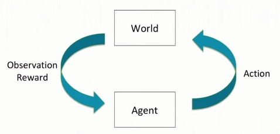
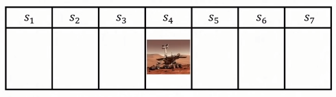
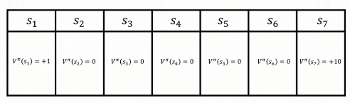
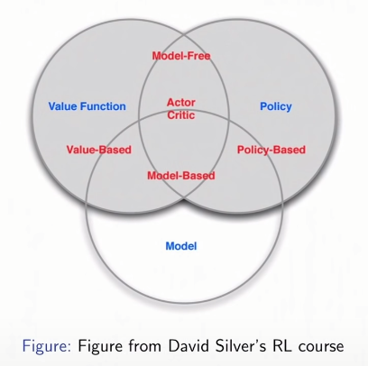

# Lec1 Introduction
## Overview of Reinforcement Learning
### [Note] 강화학습은 4가지 개념, 'optimization, delayed consequences, exploration, generalization'으로 구성되어있다.

강화학습은 똑똑한 agent가 순차적 의사 결정 문제를 잘(good) 해결할 수 있도록 학습시키는 것이다. 강화학습이 일반 machine learing과 다른 점은, 하나의 task가 아니라 순차적인 문제라는 해결한다는 것아다. 여기서 '잘' 해결한다는 것은 agent가 결정한 행동에 대해서 실용성을 측정하여 '최적'으로 행동할 수 있도록 하는 것이다. 또한 '학습'에  대해 살펴보자면, agent는 사전에 어떤 행동을 해야 좋은 결과를 낼 지 모르며 대신에 경험을 통해서 정보를 획득해야한다.  

#### - Sea Squirt : 행동을 하려면 똑똑해야합니다.(뇌가 필요합니다) 
Yael Niv로 부터의 원시 생물체(sea squirt)에 대한 예시를 보면, 어릴 때는 원시적인 뇌와 눈을 가지고 있고 헤엄치거나 돌에 붙어있는다. 그러다가 어른이 되면 스스로의 뇌를 삼키고 앉아있는다. 이것은 뇌를 가지고 있다는 것은 의사결정을 하는데 도움을 준다는 것을 암시한다. 따라서 더이상의 의사결정이 필요없어지면 뇌가 필요 없어질 지도 모른다. 그리고 이것이 왜 의사결정을 해야할 agent가 똑똑할(intelligent) 필요가 있는지 시사한다. 

#### - 강화학습의 변천사 
2015년 강화학습을 적용하여 Atari 게임을 풀었는데, 그 중 'breakout'게임을 수행한 agent는 게임의 pixel을 통해 어떻게 행동해야할 지 배웠다. 그 뒤 5년동안 엄청난 발전을 거듭했는데, 비디오 게임뿐만 아니라 robotics분야에도 널리 활용되었다. 강의 교수님의 lab실에서는 agent가 사람의 가능성을 증폭시키길 도와주는 연구를 수행하였다. 교육적인 게임을 통해 사람이 분수와 같은 개념을 빨리 배울 수 있도록 도왔다. 이외에도 healthcare분야, NLP, Vision 등 최적화 문제를 해결하는데 널리 사용되고 있다. 

#### - 강화학습의 구성 
강화학습은 4가지 개념, 'optimization, delayed consequences, exploration, generalization'으로 구성되어있다.  
1) optimization 
좋은 결정을 내린다는 점에서 '최적'의 개념이 필요하다. 

2) delayed consequences 
강화학습에서는 지금 내린 결정에 대한 당장 결과를 알지 못하고 이후에 알 수 있다. 예를 들면 3주뒤의 시험을 위해 지금 열심히 공부했을 때 그 효과를 3주뒤에나 알 수 있다. 여기서 발생할 수 있는 문제는 'credit assignment problem'인데 어떻게 지금의 행동과 미레에 받은 결과간의 인과관계를 찾냐는 것이다.

3) exploration 
다음은 어떻게 탐험하냐는 것이다. agent가 어떻게 탐험하면서 그 환경에 대한 경험을 쌓을 수 있을까. 여기서 문제는 'censored data'이다. 'censored'의 의미는 시도하는 것에 대해서만 배울 수 있다는 것이다. 예를 들면, 특정 시간에 특정 행동만 해볼 수 있으므로 다른 행동을 했을 때 얻을 수 있을 뻔했던 결과를 알지 못한다는 것이다.  

4) generalizaion 
여기서 의문이 하나 들터인데, policy가 과거의 경험과 현재 할 행동을 매핑시켜준다면 왜 미리 프로그램해둘 수 없을까. 그 이유는 'breakout'게임만 봐도 pixel들이 가질 수 있는 경우의 수는 너무 방대하다. 따라서 agent가 보지못했던 상황에서도 수행할 수 있도록 일반화의 개념이 필요하고 학습이 필요한 이유이다. 

#### - Planning vs RL 
planning과 RL이 무엇이 다른지 실펴보자. 'Go game'은 일종의 plalnnign문제라고도 할 수 있다. planning은 강화학습의 'optimization, delayed consequences, exploration, generalization' 4가지 구성 중 'exploration'을 포함하지 않는다. 이미 환경이 결정에 대해 어떻게 반응할 지 아는 모델이 주어진다. 어려운 부분은 환경 모델이 주어졌을 때 무엇을 해야 하는지 계산하는 것이다. <mark style='background-color: #ffd33d'> [질문: 왜 바둑이 planning이지? 환경 모델이 주어졌다는 말이 어떻게 대입?] </mark>

#### - Supervised learning vs RL 
지도학습은 강화학습의 'optimization, delayed consequences, exploration, generalization' 4가지 구성 중 delayed consequences, exploration 개념이 배제된다. 보통 데이터 셋이 미리 주어지기 때문에 exploration할 필요가 없고, 정답 label이 존재하기에 delayed consequences도 아니다.

#### - Unsupervised learning vs RL 
비지도 학습도 마찬가지로 delayed consequences, exploration 개념이 배제된다. 그리고 비지도 학습은 보통 label이 없는데, 강화학습은 지도학습과 비지도학습 그 사이 어딘가에 위치한다. 왜냐하면 행동(직접 부가한 label)에 대한 효용성을 얻기 때문이다. 하지만 환경에 대한 정답의 label을 얻지 않는다. 좋은 경험이라고는 할 수 있지만 그것이 정답이였다고는 말하지 못한다. 

#### - Imitation learning vs RL 
'optimization, delayed consequences, generalization'의 개념을 다 포함하지만, 다른 agent의 경험을 학습한다는 점에서 직접 'exploration'하지 않는다. 다른 agent가 경험하고 결과를 얻어가는 것을 보고 배운다. 실제 imitation learning은 매우 효과적이지만, 훈련 데이터와 달라진 state에대해 무얼 해야할 지 모르겠는 distribution shift문제가 존재한다. 강화학습과 imitation learning이 합쳐진다면 좋은 성능을 보일 수 있을 것이다. 

## Introduction to sequential decision making under uncertainty
### [Note]jj

#### - sequential decision making
순차적인 의사결정 문제는 일종의 closed-loop 상호작용이다. discrete time이라고 가정하면, agent가 환경에 대해 action $a_t$을 하고, 환경은 observation $o_t$와 reward $r_t$를 되돌려준다. 최종 목표는 최종 reward 기댓값을 최대화하는 행동을 하는 것이다. 환경 자체가 확률적일 수도 있기에 기댓값이라는 개념이 중요하다. 또한 즉시 받는 보상과 나중에 받을 보상간의 균형과 높은 보상을 받기 위한 전략적인 행동이 필요하다. 

#### - sequential decision making 문제 예시
1) web advertising예시를 살펴보면, agent는 어떤 광고를 보여줄 지 결정하고, 사람들이 얼마나 오래동안 그 광고를 봤으며 클릭했는지 알 수 있다고 하자. 여기서 목표는 고객의 클릭 수를 최대화 하는 것이다. 
2) 식기세척기에서 접시를 빼내는 로봇의 경우에는, agent가 로봇의 joint를 조절하고 이에 대한 결과로 카메라 이미지를 받고, 접시가 없다면 +1 보상을 받는다. <mark style='background-color: #ffd33d'> [25m 질문: 예시 이해 x] </mark> 
3) 다음은 혈압 조절 예시이다. agent행동은 처방된 운동이나 약일테고, 그에 대한 결과로 혈압 수치를 받아보고, 정상범위내에 들어오면 +1의 보상을 받는다. 
4) Artificial tutor에서는 agent가 덧셈(쉬움)과 뺄셈(어려움) 둘 중 하나의 교육 활동을 고른다. 그렇다면 덧셈, 밸셈 둘다 모르는 학생은 문제를 맞힐 수도 있고 틀릴 수도 있다. 문제를 맞히면 +1, 틀리면 -1의 보상을 얻는다. 여기서 보상을 최대화하려면 agent는 단순히 학생에게 쉬운 문제만 계속해서 제공하면 된다. 따라서 우리는 agent에게 특정 행동을 요구하는 시스템을 디자인할 때, 보상을 매우 신중히 결정해야한다.  
   - <mark style='background-color: #ffdce0'> [학생 질문: 이 예시에서 학생도 RL agent 아닌가요?]</mark>
   - 맞다. 하지만 여기서 환경은 RL agent가 아니라고 가정할 것이다. 더 나아가, sub-discipline of machine learning라는 분야가 있는데 2개의 agent가 서로 상호작용하면서 돕는 것이다. 예를 들어서 +, - 로 분류하는 분류기를 학습시킨다고 생각해보자. 샘플들이 필요할 것이고 사람들에게 직접 직선 위에 점을 찍어보라고 한다면, 기계가 자신을 가르치려는 것을 알고 있다면, 하나 혹은 두개의 점만 알면된다. 이것이 agent가 다른 agent가 자신을 가르치려는 사실을 알았을 때 효과이다. <mark style='background-color: #ffd33d'> [31m 질문: 이해 잘안감] </mark>

#### - History : sequence of past ($a,o,r$ ) $\rightarrow$ State space
history라는 것은 지금까지의 action, observation, reward에 대한 일련의 기록이다. $h_t = (a_1, o_1, r_1, ..., a_t, o_t, r_t)$  실제 시스템을 디자일 할때 환경을 어떻게 표현할 지, state space를 정의해야한다. 해당 강의에서는 state를 history에 대한 함수로 볼 것이다 $s_t = f(h_t)$. 실사례에서는 agent가 다른 신호 입력으로 부터 결정에 필요한 부가적인 정보를 얻을 수 있지만, 여기서는 환경으로부터 받는 observation이 전부라고 제한하겠다.   

#### - World space
문제에따라, agent는 환경 전부 혹은 그 일부분을 접근할 수 있다. 예를 들어 사람의 경우 180도 반경을 볼 수 있지만 뒤통수를 넘어서는 볼 수 없다. 뒷쪽은 사람이 접근할 순 없지만 여전히 world space이다.

#### - Markov Assuption  &nbsp;&nbsp;&nbsp;$p(s_{t+1}|s_t,a_t) = p(s_{t+1}|h_t,a_t)$
Markov Assuption이란 현재의 state가 과거 history에 대해 충분한 통계량이라는 것이다. 미래를 예측하기위해서 과거의 history는 필요없고 환경의 현재 state만 알면된다. 예를 들어, hypertension control 고혈압 문제에서 state는 현재 혈압이고, action은 약을 먹는 것이면 해당 시스템은 Markov하지 않다. 왜냐하면 운동 여부, 온도 등의 요인이 다음 state에도  영향을 미치기 때문이다. 마찬가지로, 웹쇼핑 문제에서도 state가 현재 고객에게 보여지는 제품이고, action이 다른 제품을 제시하기라면 해당 문제는 Markov하지 않다. <mark style='background-color: #f1f8ff'>[내 생각: 고객의 재정 상태, 선호도 등 살펴봐야함] </mark>

#### - Why is Markov Assumption popular?
항상 Markov하게 만들 수 있는가! 맞다! state를 history($s_t = h_t$)로 설정하면, 항상 markov 성질을 만족하게 된다. 실제 응용시에는 도메인에 따라 다르겠지만, 가장 최근의 observation이나 최근의 4개 observation이 충분한 통계량이 되도록 한다. 이때, history를 state로 쓰지 않는 이유는 정보의 양이 너무 많아지게 되서 계산복잡도, 필요한 데이터의 양, 성능 결과에 문제가 생긴다. lstm등을 적용하면서 state space에 따라 스케일이 커지는 문제의 패러다임이 조금씩 변화하고 있긴 하지만, 여전히 작은 크기의 state의 이점이 존재한다.

#### - Full Observability : Markov Decision Process(MDP) vs Partial Observability : Partially Observable MDP(POMDP)
observation이 state라고 가정하면($s_t = o_t$), 시스템을 MDP로 디자인할 수 있다. 반면, 환경을 일부만 관찰할 수 있다면, agent state와 world state가 달라진다. 따라서 agent가 과거의 history나 환경에 대해 미리 알고 있는 정보등도 함께 활용해서 행동을 결정한다. 예를 들어, 포커를 할 때 player는 자신의 패만 볼 수 있고 상대패는 볼 수 없다. 이때 상대로부터 버려지는 패들만 볼 수 있는데, 이런 상황을 partially observable하다고 한다. 다른 예시로 healthcare할 때도 모든 신체적인 경과들을 다 지켜볼 순 없지만 일부 혈압 등의 정보만 관찰할 수 있고 그 정보로 검진을 한다.

#### - Types of Sequential Decision Process
1) Bandits 
MDP의 매우 간단한 버전이다. action이 다음 observation에 영향을 미치지 않는다. 예를 들어, 웹사이트의 고객에게 광고를 보여주면 그들이 광고를 클릭하거나 하지 않는 문제가 있다고 하자. 고객1에게 어떤 광고를 보여줄지는 그 다음 누가 방문할 지(고객2가 될 지) 아무런 영향을 미치지 않는다.  
2) MDP & POMDP 
지금의 action이 다음 observation과 reward에 영향을 미치는 것이다. 현재 고객에게 어떤 제품을 추천해주냐에따라 고객의 다음 의견에 영향을 미친다. 

#### - How the World changes : Deterministic vs Stochastic
그렇다면 현재 state에서 action을 취하면 환경이 어떻게 바뀔까. 
1) Deterministic 
robotics나 control 도메인에서와 같이 환경의 변화가 결정적인 경우이다. 환경에 대한 충분하고 완벽한 모델이 있다면 deterministic하다. 특정 action을 취했을 때 결과가 무조건 한개인 경우이다. 
2) Stochastic 
실제론 환경에 대한 완벽한 모델을 알기 어렵기에 확률로 표현할 수 있다. action을 취했을 때 몇몇의 다른 결과가 도출될 수 있는 경우이다. 고객에게 특정 광고를 보여줬을때(action) 고객은 그 광고를 클릭할 수도, 클릭하지 않을 수도 있기 때문에 확률로 표현한다. 

#### - Example: Mars Rover as a Particular MDP
탐사선이나 로봇을 지구 멀리 보내면 그들과 소통하기 어렵기에 자동으로 작동할 수 있도록 만드는 게 좋다. 7가지 state(도착점)를 가진 탐사선이 있다고 가정하자. action은 왼쪽, 오른쪽으로 이동하는 것이지만 왼쪽을 결정했을 때 진짜로 왼쪽으로 움직이게 될 지는 모르는 stochastic한 상황이다. reward로는 $s_1 = +1, s_7 =+10$, 나머지 state는 0이다. 

해당 문제에서 RL 구성요소로는,
1) Model  
agent의 action에 대해서 환경이 어떻게 반응할까에 대한 표현이다.
   -  Transition probability, dynamics model : $p(s_{t+1}=s'|s_t=s,a_t=a)$ 
  현재 state와 action이 주어질 때 도달할 다음 state에 대한 확률 분포로 표현한다. 
   - Reward model : $r(s_t=s,a_t=a) = E[r_t|s_t=s,a_t=a]$ 
  현재 state와 action에 대해 기대되는 reward이다.  

    해당 문제에서 탐사선 제어가 매우 어려워서 action대로 state가 바뀔 확률과 그대로 머물 확률이 각각 50%라고 하자. Transition model은 $p(s_1|s1,\text{TryRight}) = p(s_2|s1,\text{TryRight})=0.5$ 등등 일 것이다. 그리고 Reward model은 모든 state에서 0이라고 하자.   이렇게 설정하면 모델은 공교롭게도 틀렸다. 이처럼 많은 경우 모델은 잘못 설정될 확률이 높지만, 여전히 agent는 유용하게 사용할 수 있다. 

2) Policy 
MDP문제로 본다면, policy는 observation이랑 action을 매핑시켜주는 역할이다. 
   - Deterministic policy : $\pi(s) = a$ 
    하나의 state당 하나의 action만 있는 경우이다. 
   - Stochastic policy : $\pi(a|s) = P(a_t = a| s_t =s)$ 
    하나의 state에 대해 가능한 action에 대한 분포이다. 
    
    여기서 정책은 매 state마다 오른쪽으로 가는 dererministic policy로 정한다.  $\pi(s_1) = \pi(s_2)  ... = \text{TryRight}$

3) Value function 
$V^\pi(s_t = s) = E_\pi[r_t + \gamma r_{t+1} + \gamma^2r_{t+2}+...|s_t=s]$  
value function은 discounted factor를 반영한 미래에 받을 reward 총합의 기대값이다. 지금 state에서 현재랑 미래에 받을 reward까지 고려하는 것이다. 이때 당장 받을 reward가 중요한지 혹은 나중에 받을 reward가 중요한지에 따라 discounted factor $\gamma$가 달라진다. $\gamma \in (0,1)$ value function을 통해서 어떤 state가 좋고 나쁜지 알 수 있다.  
다시 탐사선 문제로 돌아오면, discoutned factor = 0으로 하고, 현재의 policy(오른쪽으로 이동)에 따라 가치함수는 다음과 같다. 

<mark style='background-color: #ffdce0'> [학생 질문 : $\gamma$가 0이 아니라면 얼마나 이동하냐에 따라 reward가 감소, 증가하나요?]</mark> 
$\gamma$가 0이라는 것은 당장 받을 reward만 고려한다는 것이고, 0이 아니라면 다른 state로 이동할수록 변한다.

#### - Types of RL Agents : Model based vs Model free
<mark style='background-color: #ffd33d'> [질문: 이거 이해안됨] </mark>
1) Model-based 
환경이 어떻게 돌아가는지에 대한 표현을 직접적인 모델, Transition model이나 reward model을 통해 유지한다. policy나 value function이 없을 수도 있다. 주어진 state에 대해선 어떤 action을 할지 policy를 계산해야겠지만, 모든 state에 대한 명백한 표현이 없을 수도 있다. 
2) Model-free 
모델 대신에 명백한 value function이나 policy function이 존재하는 경우이다. 

#### - Key Challenges in Learning to Make Sequences of Good Decisions
- planning 
좋은 결정을 내리기 어려운 이유 중 하나는 planning이다. 환경이 어떻게 작동하는 지에 대한 model이 있다고 하더라도, 어떤 action을 할 지 결정해야한다. model이 주어진다면, 환경과 상호작용하지 않아도 좋은 action을 결정할 수 있다. 계산을 통해 reward 기댓값을 최대화 할 수 있는 action을 고를 수 있다. 
- RL 
가장 좋은 action이란 것은 현재까지 주어진 정보에 뿐만 아니라 앞으로 필요한 정보를 가져다 줄 행동인지도 고려해야한다. 예를 들어, 5가지 메뉴가 있는 새로운 식당에 갔을 때, 최고의 메뉴를 찾아보고 싶다. 매일 한 메뉴씩 시도해볼 수 있을 것이고, 오랜 시도 끝에 최고의 메뉴를 찾을 수 있다. 여기서 agent는 미래에 좋은 결정을 내리기 위한 정보를 얻기 위해서 어떤 결정을 할 지  고려해야한다.  <mark style='background-color: #ffd33d'> [질문: 오늘까지 먹었던 메뉴를 기반해서 최고의 메뉴를 고를 수 없다라는 거!!] </mark>

#### - Planning Example
Solitaire 라는 혼자하는 카드게임을 살펴보자. 게임 규칙을 모두 알고있기에 perfect model이다. 특정 state에서 action을 했을 때 다음 state로의 transition probability도 알고 있고, 그때 받게 될 reward도 계산할 수 있다. 따라서 tree search나 dynamic programming을 통해서 최적의 action을 고를 수 있다.

#### - RL Example
Solitarie게임인데 규칙을 모른채로 진행하는 경우이다. action을 취해보면서 어떤 결과를 얻는 지 살펴보면서 배워나가야한다. 이를 통해서 model을 계산하거나, policy 혹은 value function을 직접 계산할 수도 있다. 

#### - Exploration and Exploitation
화성 탐사선 예시에서는 시도, 탐험을 통해서만 환경이 어떻게 반응하는지 알 수 있었다. 하지만 탐험만 하면 딜레마에 빠질 수 있다. 과거의 경험을 바탕으로 좋아보이는 것이랑 미래에 좋을 것으로 예상되는 것 중에서 균형을 찾아야 하기 때문이다. Exploration에서는 지금까지 안해봤던 시도나, 지금까지에 경험에 의하면 나쁠테지만 미래에는 좋을 것이라고 기대되는 시도들을 해본다. Exploitation은 지금까지의 경험을 그대로 이용해서 좋은 행동을 결정하는 것이다. 예를 들어, Exploration은 새로운 영화를, Exploitation은 좋아하는 영화를 보는것이다.  

<mark style='background-color: #ffdce0'> [학생 질문 : ]</mark> 
A) finite horizon에서 policy계산은 고정적이지 않다. state뿐만 아니라 time step에 따라서도 policy가 변한다. infinite일 경우는 고정적이다. 왜 우리는 explore하는가. 미래에 받을 reward까지 고려하기 때문인데, finite인 경우, 마지막 날일때는 더이상 미래를 위해 탐험하지 않을 것이다. 왜냐하면 마지막이기에 다음 action을 결정할 필요가 없기에 항상 exploitation을 하고 그게 최적이다.  

<mark style='background-color: #ffdce0'> [학생 질문 : finite인데 현재 어디있는지 모르면 어떡함? game theory에서는 매우 어렵던데,,]</mark> 
A) 이것을 indefinite horizon problem이라고 부르겠다. 이때 termination state가 있는 infinite horizon problem으로 보는 것이다. 몇몇의 state에 도달하면 끝나게 되는 것으로 봐서 그 끝나는 지점에 도착하게 될 확률을 살펴본다. <mark style='background-color: #ffd33d'> [질문: 이해안감] </mark> 

<mark style='background-color: #ffdce0'> [학생 질문 : driving 에서는 아예 새로운 경로로 가는 explore보다 exploit가 항상 낫지 않느냐]</mark> 
A) 보통은 explore& exploit 섞어서 행동하는게 좋다. 하지만 경우에 따라 초반에는 explore만해서 미래를 위해 정보를 얻을 수 도 있다. 즉 경우에 따라 다르다. high-stack 도메인, 즉 사람에게 영향을 주는 도메인에서는 특히 중요한 문제이다.

<mark style='background-color: #ffdce0'> [학생 질문 : 기존에 보지 않았던 state에 대해서는 랜덤으로 결정하나요 아니면 기존의 경험을 사용할 수 있나요? ]</mark> 
A) generalization 역할이 그것이다. 새로운 state에 대해서도 그간의 경험을 이용할 수 있도록 할 것이다. 

#### - Evaluation and Control
1) Evaluation은 주어진 policy를 평가하는 것이다. 환경에 대한 model이 없다면 데이터를 얻어서 현재의 policy가 좋은 지 평가할 수 있도록 해야한다.  
2) Control은 최적화 문제이다. 좋은 policy를 찾았다고 하자. 이것은 sub-component evaluation으로 구성되어있을 것이다.<mark style='background-color: #ffd33d'> [질문: 1h1 설명이해안감] </mark>
강화학습이 좋은 점이 'evaluation off policy'가 가능하다는 것이다. 다른 policy로 부터 얻은 데이터를 사용해서 상호 다른 policy가 어떤 행동을 했을지 비교 평가가 가능하다. 모든 policy를 전부 시도해보지 않아도 된다는 점에서 아주 유용하다. <mark style='background-color: #ffd33d'> [질문: evaluation off policy 이해안감] </mark>  

예를 들어, Evaluation측면에서는, 화성 탐사 문제에서 모든 state에 대해 오른쪽으로 가는게 policy인데, 그럼 이 policy의 value를 계산 혹은 평가해줘!라고 하는 것이다. 반면 Control측면에서는 어떤 policy든지 discounted factor를 고려했을 때 기댓값 총합이 최대가 되는 policy를 알려줘! 이다. 그렇다면 여기서 무엇으로 부터의 기댓값이냐는 것이다. 이떄, 특정 시작 시점 같은 조건들을 고려해야할 것이다.  <mark style='background-color: #ffd33d'> [질문: 이해 x] </mark>

<mark style='background-color: #ffdce0'> [학생 질문 : 최적의 policy와 최적의 reward function을 동시에 구할 수 있나요?]</mark> 
A) 최적의 policy가 무엇인지, reward function이 무엇인지 모른다고 하자. 이때 특정 policy가 주어졌고 그걸 평가했는데 좋지 않았다. 그럼 여기서 처음부터 경험을 다시 쌓아야하나, 아님 그 경험들을 사용하여 다음 policy를 알 수 있을까? 보통 그 경험들을 사용해서 다음 policy를 구해볼 수 있다. 여기서 주의해야할 것은 action이 확률적이기에 하나의 state에서 하나의 action만 한다면 다른 action들에 대해선 배울 수 없다. 그래서 policy에 확률적 요소를 반영해서 다른 policy를 평가할때도 유용하도록 해야한다. <mark style='background-color: #ffd33d'> [질문: 이해 x] </mark>