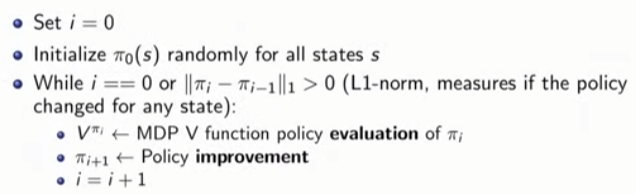
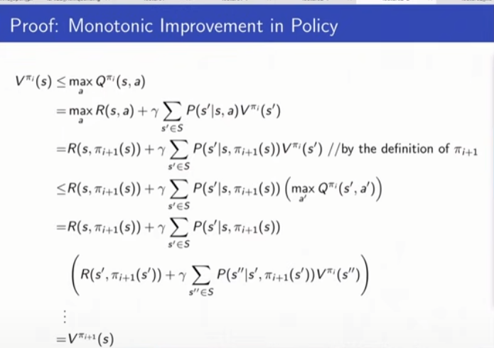
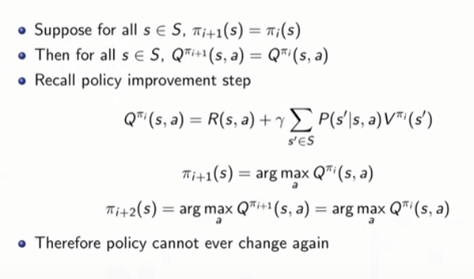
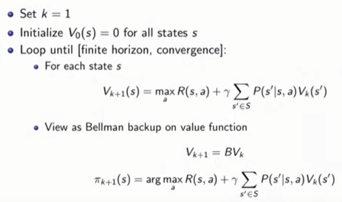
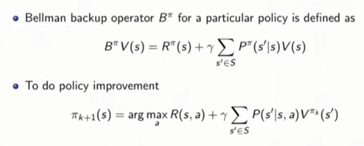
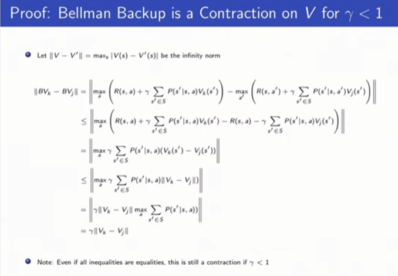
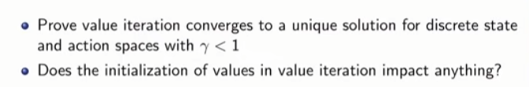

# Lec2  - Given a Model of the World
## Today: Given a model of the model
### [Note] 
이번 강의에서는 model이 주어졌을 때 어떻게 planning할 지 배운다. (cf. 모델이 주어지지 않는 경우는 learning이라고 부른다.) delayed consequences인 상황에서 무엇을 하는게 옳은 것인지 배우고자 한다. 때론, 전체적인 reward를 최대화 하기위해서 당장의 reward를 희생하기도 해야할 것이다. 이를 위해서 Markov Process, Markov Reward Processes(MRPs), Markov Decision Processes(MDPs), Evaluation and Contorl in MDPs에 대해 다룰 것이다. 

## Full observability: MDP
### [Note]

agent가 환경(world)과 상호작용하면서 환경에 action $a_t$를 취하고, 환경은 이에 따라 반응한 뒤 state $s_t$(혹은 observation), reward $r_t$를 반환한다. Markov property를 다시 떠올려보면, 현재의 state가 전체의 history를 추론하기 충분한 통계량이라는 것인데 **$p(s_{t+1}|s_t,a_t) = p(s_{t+1}|h_t, a_t)$**, 이러한 Markov상황에서 agent는 전체 history가 아닌 현재의 state에만 집중한다. 전체 history를 합쳐서 Markov한 상황을 만들 수도 있겠지만, 최근 진행중인 대부분의 연구는 현재의 state만 집중하는 것을 가정한다. 

### - Markov Process(Markov Chain) 
Markov Process이란, Markov property를 만족하는 랜덤한 일련의 state들이다. 여기서는 reward, action 개념은 배제하고, 시간에 따른 일련의 확률적인 state들만 고려한다. 예를 들면, 주식 시장 가격이 시간에 따라 어떻게 변화하는지 지켜보는 것과 같다.   
Markov Process 구성 
- $S \text{ : set of (finite)states }$ 
- $P \text{ : transition model} : p(s_{t+1}=s'|s_t)$  
finite state라면, $P$를 도달 가능한 다음 state들에 대한 transition 행렬로 표현할 수 있다. 이때 state가 7개인 Mars Rover예시에서 현재 state가 $s_1$이라면, 다음 state의 확률 분포는 행렬 곱, $[1,0,0,0,0,0,0]P$ 로 계산할 수 있다. 

 

### - Markov Reward Process(MRP) 
MRP는 Markov Process 에 reward 개념을 더한 것이다. 
MRP 구성 
- $S(\text{states})$
- $P(\text{transition model})$
- $R(\text{reward funciton})$ : $R(s_t=s) = E[r_t|s_t=s]$ 
  Reward function은 특정 state에서의 reward 기댓값이다 . 여기서 discount factor $\gamma$도 고려하여 즉시 받을 보상과 나중에 받게될 보상 사이의 비율을 조절한다. finite state이면, $R$은 특정 state에 대한 reward vector로 표현된다. 

#### - Return & Value function 
- Horizon  각 에피소드의 총 time step을 의미한다. infinite 또는 finite 할 수 있다.  
- Return $G_t$    $G_t = r_t + \gamma r_{t+1} + \gamma^2r_{t+2} + ...$  
시간 t부터 horizon(끝)까지 discout factor를 반영한 reward의 총합이다.  
- State Value Funciton $V(s)$  $V(s) = E[G_t|s_t=s] = E[r_t + \gamma r_{t+1} + \gamma^2r_{t+2} + ...|s_t = s]$  
value function은 return의 기댓값이다. 따라서 deterministic한 환경이면, return과 value function은 같고, stochastic이면 이 둘은 다르다. 여기서 deterministic의 의미는 가능한 다음 state가 항상 하나뿐인 경우이다.  
 #### - Discount Factor 
 우리는 미래에 받을 reward를 즉시 받을 reward보다 낮게 평가하는 것이 일반적이며, discount factor를 통해서 이 둘간의 경중을 조절할 수 있다.  discount factor, $\gamma=0$이면, 즉시 받을 reward만 고려하는 것이고, $\gamma=1$이면, 나중에 받을 reward의 가치도 현재와 동일하게 평가하는 것이다. 추가적으로, discount factor을 사용하는 수학적인 이점은 return과 value가 무한이 되는 것을 방지한다. 만약에 episode가 유한하면 $\gamma$를 1로 설정해도 된다. <mark style='background-color: #ffd33d'> [질문: 왜  $\gamma$를 1로 설정해도?] </mark>

 #### - Computing the value of a Markov Reward Process 
 1) Simulation 
 value function을 계산하는 첫번째 방법은 여러번의 simulation을 통해서 추론하는 것이다. 주어진 transition probability와 reward model을 사용해서 episode를 여러번 반복한다. 그 다음, 평균을 취하면 이는 곧 expected return인 value로 수렴한다. 정확도는 대략적으로 $1/\sqrt(n)$, ( n=시도한 횟수) 이다. 이 방법의 장점은 Markov Reward Process의 구조를 가정하고 있지 않다는 것이다. 
 1) Analytic Solution: Markov property(Only finite state $\therefore$ 행렬로 표현가능) 
MRP : $V(s) = R(s) + \gamma \sum_{s' \in S}P(s'|s)V(s')$ 
Markov property를 만족한다면,  value function을 위와 같이 분해할 수 있고, 계산이 훨씬 쉬워진다. $R(s)$는 즉시 받게될 보상이고, $\gamma \sum_{s' \in S}P(s'|s)V(s')$은 미래의 보상이다. 아래 식을 통해 구한 value function은 다음과 같다. 
$V - \gamma PV = R$,  $(I - \gamma P)V = R$, **$V = (I - \gamma P)^{-1}R$** 

<mark style='background-color: #ffdce0'> 항상 invertible 한가? P가 transition matrix이기 때문에 eigen value가 1보다 작거나 같다. 그리고 discount factor가 1보다 작으면,$(I - \gamma P)$가 항상 invertible하다. <mark style='background-color: #ffd33d'> [질문: 왜???????] </mark> </mark> 
 matrix inverse를 계산해야기 때문에 계산복잡도가 $O(N^3)$이다.  

 3) Dynamic Programming 
 이 방법은 방법2와 같이 한번에 계산해내는 것이 아니라 반복적인 계산을 통해 구하는 것이다.
 우선 모든 Value function을 0으로 초기화 한다. 그리고 k = 1부터 수렴할 때까지($|V_k -V_{k+1}|<\epsilon$) 모든 state에 대해서 k-1때의 다음 state value값을 사용하여 현재 value를 계산한다. 이때의 계산복잡도는 매 반복마다 $O(|S|^2), |S|=N$이다. 
 $V_k(s) = R(s) + \gamma \sum_{s' \in S}P(s'|s)V_{k-1}(s')$
   

### - Markov Decision Process(MDP)  
MDP 구성 :  $(S, A, P , R, \gamma)$ 
 - $S$: (finite) set of Markov states 
 - $A$: (finite) set of actions 
 - $P$: transition model for each action, $P(s_{t+1}=s'|s_t=s,a_t=a)$  
 - $R$: reward function, $R(s_t = s, a_t=a) = E[r_t|s_t=s, a_t=a]$ 
 - $\gamma$: discout factor 
이때, transition model이 '확률'인 이유는, 실제 정확한 model을 갖기 어렵기 때문에 확률을 통해 그 불확실성을 표현한 것이다. 예를 들어, 로봇에게 어떤 동작을 시켜도 카페트 마찰력에 영향을 받는 등 항상 명령대로 행동하기 어렵다.   

#### - MDP Policies $\pi(a|s)$ 
MDP Policy는 각 state에서 어떤 행동을 할 지 알려준다. policy가 deterministic이면, state를 단 하나의 action에 매핑하는 것이고, stochastic이면 policy를 가능한 action에 대한 분포로 나타낼 수 있다. MDP에 policy의 개념을 더하면 MRP가 된다. 따라서 고정된 policy가 있다면, MRP에 사용했던 3가지 방법(simulation, analytic, dynamic)을 policy의 value구하는데 그대로 적용할 수 있다.  

**MDP + $\pi(a|s)$** = Markov Reward Process $(S, R^{\pi}, P^{\pi}, \gamma)$  $R^{\pi} = \sum_{a \in A}\pi(a|s)R(s,a)$, $P^{s'|s} = \sum_{a \in A}\pi(a|s)P(s'|s,a)$

#### - MDP Policy Evaluation, Iterative Algorithm 
이제 iterative 식을 다시 살펴보면, deterministic policy일 경우 action을 $(s,\pi(s))$를 사용하여 작성할 수 있다. 이는 **Bellman backup**이라고도 불린다. (One backup : $V_{k=1} \rightarrow V_{k=2}$) 여기서 value function은 현재 정책을 따랐을 때 받게 될 reward와 미래 reward를 통해 계산한 값이다. 다음 계산을 반복할 수록, 미래의 보상이 앞으로 전파되는 듯한 양상을 보인다.  
$V_{k}^\pi(s) = r(s,\pi(s)) + \gamma \sum_{s' \in S}P(s'|s,\pi(s))V_{k-1}^\pi(s')$
 
+) 이외에도 simulation이나 analytic하게 계산할 수 도 있다.

#### - MDP Control 
policy를 평가하는 것에서 그치지 않고, optimal policy가 무엇인지 알아야한다. 이때, **state의 value가 최대가 되는 오직 1개의 optimal value function이 존재**한다. optimal policy를 따랐을 때 value function이 최대가 된다.   

$\pi^*(s)=\argmax_\pi V^\pi(s)$

optimal policy 특징(infinite horizon) 
1) deterministic 
   특정 state에서 단 하나의 행동과 매핑한다.
2) stationary  stationary란, time-step에 따라 달라지지 않는 것을 의미한다. 예를 들어 $s_7$에서의 optimal policy가 action1이라면, 현재 time-step이 뭐든 간에 항상 action1 로 일정하다.
3) Not Unique 
    **optimal policy는 유일하지 않고** value function을 최대로 만드는 여러개의 optimal policy가 있을 수도 있다.   

### - MDP Policy Iteration (PI) 
가능한 총 deterministic policy는 $|A|^|S|$개다. state가 7개, action이 2개인 Mars Rover예시에서 총 deterministic policy개수는 $2^7$개이다. 이때, policy iteration방법이 모든 정책을 시도해보고 그 중 최대를 찾는 방법인, enumeration보다 낫다.  
Policy Iteration의 개요는 특정 policy하에서의 value를 평가하고 개선시키고, 더이상 개선시킬 수 없을 때 멈춘다. 시작은 모든 state에 대해서 policy($\pi_0(s)$)를 랜덤으로 초기화한다. 그 다음, policy evaluation과 policy improvement를 한다. <mark style='background-color: #ffd33d'> [질문: 51m pseudo code에서 'L1 norm>0' 의 의미가 '특정 state에서 policy의 명령(action)이 달라졌을 때'로 해석하면 되는 거 맞나요? policy가 정량적인 개념은 아닌 같은데 L1 norm으로 표현하는 것이 신기합니다! 관례적으로(?) 이렇게 표기하기도 하나요?] </mark>

 

#### - Policy Improvement 
Policy Improvement를 위해선 State-Action Value Q를 정의해야한다.
$Q^\pi$는 현재 state에서 policy에 상관없이 어떤 action(a)을 취해서 state $s'$로 이동하고, 그 다음 policy에 따라 $v'$에서의 value를 얻는다. 
 $Q^\pi(s,a) = R(s,a) + \gamma \sum_{s' \in S}P(s'|s,a)V^\pi(s')$
 
policy evaluation을 통해 value를 얻었다면, $V^{\pi_i}$에서 $Q^{\pi_i}(s,a)$를 계산한다.
 $Q^{\pi_i}(s,a) = R(s,a) + \gamma \sum_{s' \in S}P(s'|s,a)V^{\pi_i}(s')$
 
그 다음은 policy improvement다. argmax일 때의 action($a$)를 택하므로, $Q^{\pi_i}(s,a) \geq Q^{\pi_i}(s,\pi_i(s))$ 이다. 
 
$\pi_{i+1}(s) = \argmax_a Q^{\pi_i}(s,a), \forall s\in S$

#### - Deeper into PI Step 
현재 state에서 Q 최대값은 항상 기존의 policy로부터의 value보다 항상 크거나 같다.   
$\max_a Q^{\pi_i}(s,a) \geq R(s,\pi_i(s)) + \gamma \sum_{s' \in S}P(s'|s,\pi_i(s))V^{\pi_i}(s') = V^{\pi_i}(s)$ 
   policy improvement 과정을 통해 모든 state에서 policy가 다음과 같이 갱신된다. 
$\pi_{i+1}(s) = \argmax_a Q^{\pi_i}(s,a)$

#### - Monotonic Improvement in Policy 
argmax action을 고르고 그 다음은 과거의 policy를 따랐을 때 항상 그 전보다 나아짐을 확인할 수 있다. 하지만 policy improvement는 그 다음부터도 과거의 policy를 따르지 않고 새로운 policy를 따르는 것이다. 이때 새로운 policy 가 과거의 policy를 monotonic improvement한 버전임을 살펴보자. 
- monotonic improvement  
 $V^{\pi_1}(s) \geq V^{\pi_2}(s) ,\forall s\in S$ 
모든 state에 대해서 지난번의 정책보다 현재 정책에서의 value가 항상 크거나 같다.  여기서 proposition은 $V^{\pi_{i+1}} \geq V^{\pi_i}$, ($\pi_i$ 가 suboptimal일 때는 strict inequality만족)  이때 $\pi_{i+1}$는 $\pi_i$로 부터 improvement 된 버전이다. <mark style='background-color: #ffd33d'> [질문: 증명 이해X] </mark>

#### - Policy Iteration (PI) 이해 
질문 1) policy가 한번 변하지 않으면, 다시 변할 수 있는가? 
$\pi_{i+1} = \pi_i$ 인 상황이 발생하면 다신 변할 수 없다.  

질문 2) policy iteration의 최대 iterations수가 있는가? 
monotonic improvement 성질 때문에 iteration수는 최대 가능 policy의 갯수($|A|^|S|$)를 넘길 수 없다.  

### - Value Iteration(VI) 
value iteration을 통해 optimal policy를 구할 수 있다. policy iteration은 항상 policy가 존재하고, 그 policy를 계속적으로 개선시키는 것이였다. 반면, value iteration은 유한개의 step에서 optimal value를 계산한다. <mark style='background-color: #ffd33d'> [질문: 이해 X] </mark>policy내에 optimal value가 무엇인지 알고있으며 k time steps만큼 행동한다. 하지만 이 둘은 결국 같은 곳으로 수렴한다. 

#### - Bellman Equation and Bellman Backup Operators 
policy의 value는 즉시 받을 보상 + discounted sum of future rewards 
Bellman equation : $V^\pi(s) = R^\pi(s) + \gamma \sum_{s' \in S} P^\pi(s'|s)V^\pi(s')$  

Bellman backup operator: old value function을 새로운 value function으로 바꾼다.  
$BV(s) = \max_aR(s,a) + \gamma \sum_{s' \in S} P(s'|s,a)V(s')$

모든 state 의 value를 0으로 초기화한다. 그 다음 유한개의 horizon혹은 수렴때까지 모든 state s에 대해 $V_{k+1}(s) = \max_a R(s,a) + \gamma \sum_{s' \in S} P(s'|s,a)V_k(s')$ 반복한다. 
$V_{k+1} = BV_k$

#### - Policy Iteration as Bellman Operations 
Bellman backup operator $B^\pi$는,
$B^\pi V(s) = R^\pi(s) + \gamma \sum_{s' \in S} P^\pi(s'|s)V(s')$ 

$V^\pi = B^\pi B^\pi B^\pi...V$ V가 더이상 변하지 않을 때까지 반복한다.

#### - Contration Operator 
$O$ : operator $|x|$: norm of x 
if $|OV-OV'| \leq |V-V'|$ , $O$는 contraciton operator이다.

#### - Is Value Iteration Converge? 
수렴한다. discount factor가 1보다 작고 마지막 state에서 확률1을 가진다. 그리고 Bellman backup은 contraction하기에 , 서로 다른 value function에 bellman eqauation을 각각 적용하면 그 거리는 더 짧아질 것이다. 

#### - Last Question 

<mark style='background-color: #ffdce0'> state value V vs state-action value Q?</mark>