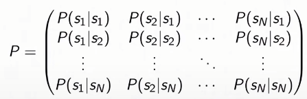
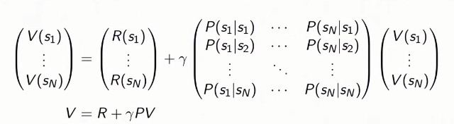

# Lec2  - Given a Model of the World
## Today: Given a model of the model
### [Note] 
이번 강의에서는 delayed consequences인 상황에서 무엇을 하는게 옳은 것인지 배우고자 한다. 때론, 전체적인 reward를 최대화 하기위해서 당장의 reward를 희생하기도 해야할 것이다. Markov Process, Markov Reward Processes(MRPs), Markov Decision Processes(MDPs), Evaluation and Contorl in MDPs에 대해 배워볼 것이다. 

## Full observability: MDP
### [Note]
agent가 환경(world)과 상호작용하면서 환경에 action $a_t$를 취하고, 환경은 이에 따라 반응한 뒤 state $s_t$(혹은 observation), reward $r_t$를 반환한다. Markov property를 다시 떠올려보면, 현재의 state가 전체의 history를 추론하기 충분한 통계량이라는 것인데 **$p(s_{t+1}|s_t,a_t) = p(s_{t+1}|h_t, a_t)$**, 이러한 Markov상황에서 agent는 전체 history가 아닌 현재의 state에만 집중한다. 전체 history를 합쳐서 Markov한 상황을 만들 수도 있겠지만, 최근 진행중인 대부분의 연구는 현재의 state만 집중하는 것을 가정한다. 

#### - Markov Process or Markov Chain 
Markov Process이란, Markov property를 만족하는 랜덤한 일련의 state들이다. 여기서는 reward, action은 배제하고, 시간에 따른 일련의 확률적인 state들만 고려한다. 예를 들면, 주식시장 가격이 시간에 따라 어떻게 변화하는지 지켜보는 것과 같다.   
Markov Process는 $S \text{ : set of states }$와 $P \text{ : transition model,  }p(s_{t+1}=s'|s_t)$로 구성되어 있다. 만약 유한적인 state라면, $P$를 도달 가능한 다음 state들에 대한 transition 행렬로 표현할 수 있다. 이때 현재 state가 $s_1$이라고, 다음 state의 확률 분포는 행렬 곱, $[1,0,0,0,0,0]P$ 로 계산할 수 있다. 

 

#### - Markov Reward Process(MRP) 
MRP는 Markov Process 에 reward 개념을 더한 것이다. $S(\text{states}), P(\text{transition model})$에 $R(\text{reward funciton})$가 추가된다. Reward function은 특정 state에서 기대되는 reward이다 $R(s_t=s) = E[r_t|s_t=s]$. 여기서 discount factor $\gamma$도 고려하여 즉시 받을 보상과 나중에 받게될 보상 사이의 비율을 조절한다. 유한한 state이면, $R$은 특정 state에 대한 reward vector로 표현한다. 

#### - Return & Value function 
- Horizon  각 에피소드 당의 time step을 의미한다.  
- Return $G_t$    $G_t = r_t + \gamma r_{t+1} + \gamma^2r_{t+2} + ...$  
시간 t부터 horizon(끝)까지 discout factor를 고려한 reward의 총합이다.  
- State Value Funciton $V(s)$  $V(s) = E[G_t|s_t=s] = E[r_t + \gamma r_{t+1} + \gamma^2r_{t+2} + ...|s_t = s]$  
value function은 반환값의 기댓값이다. 따라서 deterministic한 환경이면, return과 value function은 같고, stochastic이면 이 둘은 다르다. <mark style='background-color: #ffd33d'> [질문: deterministic이면 transition probability가 항상 1?] </mark>stochastic이면, time step수가 달라지면 reward도 달라진다. 

 #### - Discount Factor 
 우리는 일상생활에서도 미래에 받을 reward를 즉시 받을 reward보다 낮게 평가할 때가 있다. discount factor를 통해서 이 둘간의 균형을 조절할 수 있다.  discount factor, $\gamma=0$이면, 즉시 받을 reward만을 고려하는 것이고, $\gamma=1$이면, 나중에 받을 reward의 가치도 현재와 동일하게 평가하는 것이다.추가적으로, discount factor을 사용하는 수학적인 이점은 return과 value가 무한이 되는 것을 방지한다. 만약에 episode가 유한하면 $\gamma$를 1로 설정해도 된다. <mark style='background-color: #ffd33d'> [질문: 왜  $\gamma$를 1로 설정해도] </mark>

 #### - Computing the value of a Markov Reward Process 
 1) Simulation 
 value를 계산하는 방법은 simulation을 통해서 추론하는 것이다. 주어진 transition probability와 reward model을 사용해서 여러번의 episode를 반복해본다. 그 다음, 평균을 취하면 이는 곧 expected return인 value로 수렴한다. 정확도는 대략적으로 $1/\sqrt(n)$, ( n=시도한 횟수) 이다. 이 방법의 장점은 Markov Reward Process의 구조를 가정하고 있지 않다는 것이다. 
 2) Analytic Solution: Markov property(Only when finite state <mark style='background-color: #ffd33d'> [28m30s 질문: finite state라는 제한 언제 언급?] </mark>) 
MRP : $V(s) = R(s) + \gamma \sum_{s' \in S}P(s'|s)V(s')$ 
Markov property를 만족한다면, 계산이 훨씬 용이해진다. value function을 위와 같이 분해할 수 있다. $R(s)$는 즉시 받게될 보상이고, $\gamma \sum_{s' \in S}P(s'|s)V(s')$은 미래의 보상이다. 아래 식을 통해 구한 value function은 다음과 같다. 
$V - \gamma PV = R$,  $(I - \gamma P)V = R$, **$V = (I - \gamma P)^{-1}R$** 
 matrix inverse를 계산해야기 때문에 계산복잡도가 $O(N^3)$이다.  

<mark style='background-color: #ffdce0'> 항상 invertible 한가? P가 transition matrix이기 때문에 eigen value가 1보다 작거나 같다. 그리고 discount factor가 1보다 작으면,$(I - \gamma P)$가 항상 invertible하다. <mark style='background-color: #ffd33d'> [질문: 왜???????] </mark> </mark>

 3) Dynamic Programming
 이 방법은 한번에 계산해내는 것이 아니라 반복적인 계산을 통해 구하는 것이다.
 우선 모든 Value function을 0으로 초기화 한다. 그리고 k = 1부터 수렴할 때까지($|V_k -V_{k+1}|<\epsilon$) 모든 state에 대해서 다음과 같이 계산한다.

$V_k(s) = R(s) + \gamma \sum_{s' \in S}P(s'|s)V_{k-1}(s')$
  bootstrap하기 위해서 k-1때의 value값을 사용하여 다음 value를 계산한다. 이때의 계산복잡도는 매 반복마다 $O(|S|^2), |S|=N$이다. 

#### - MDP : $(S, A, P , R, \gamma)$ 
 $S$: set of Markov states 
 $A$: set of actions 
 $P$: transition model for each action, $P(s_{t+1}=s'|s_t=s,a_t=a)$  
 $R$: reward function, $R(s_t = s, a_t=a) = E[r_t|s_t=s, a_t=a]$ 
 $\gamma$: discout factor 
이때, transition model이 여전히 '확률'인 이유는, 실제 정확한 model을 갖기 어렵기 때문에 확률을 통해 불확실성을 표현한 것이다. 예를 들어, 로봇에게 어떤 동작을 시켜도 카페트 마찰력에 영향을 받는 등 항상 그대로 행동하는 것이 아니다.   

#### - MDP Policies $\pi(a|s)$ 
MDP Policy는 각 state에서 어떤 행동을 할 지 알려준다. policy자체도 deterministic하게 다음 action을 바로 매핑하거나 혹은 stochastic하게 가능한 action에 대한 분포를 나타낼 수 있다.  

**MDP + $\pi(a|s)$** = Markov Reward Process $(S, R^{\pi}, P^{\pi}, \gamma)$  $R^{\pi} = \sum_{a \in A}\pi(a|s)R(s,a)$, $P^{s'|s} = \sum_{a \in A}\pi(a|s)P(s'|s,a)$

이를 통해, 고정된 policy가 있다면, MRP를 위해 사용했던 3가지 방법(simulation, analytic, dynamic)을 policy의 value구하는데 그대로 적용할 수 있다. 

#### - MDP Policy Evaluation, Iterative Algorithm 
이제 iterative 식을 다시 살펴보면, deterministic policy일 경우 action을 $(s,\pi(s))$를 사용하여 작성할 수 있다. 
$V_{k}^\pi(s) = r(s,\pi(s)) + \gamma \sum_{s' \in S}P(s'|s,\pi(s))V_{k-1}^\pi(s')$
 이는 **Bellman backup**이라고도 불린다. (One backup : $V_{k=1} \rightarrow V_{k=2}$)  현재 정책을 따랐을 때 받게 될 reward와 미래 reward를 통해 계산한 값이다.  
+이외에도 simulation이나 analytic하게 계산할 수 도 있다.

#### - MDP Control 
policy를 평가하는 것에서 그치지 않고, optimal policy가 무엇인지 알아야한다. 이때, **오직 1개의 optimal value function이 존재**한다. optimal policy를 따랐을 때 value function의 최대값이 존재한다. 또한 horizon이 유한일 때, optimal policy는 deterministic이고, stationary(time-step에 달려있지 않음, $s_7$에 도달하기 위한 optimal policy는 현재 time-step이 뭐든 간에 동일함)이다.<mark style='background-color: #ffd33d'> [질문: 이해안감 49m] </mark> </mark>
   하지만 optimal policy가 유일하지않고 상황에 따라 다르다. state가 7개, action이 2개인 rover 예시에서는 총 deterministic policy개수는 $2^7$개, 일반화하면 $|A|^S$이다. 이는 finite한 갯수이므로 범위가 정해진다. 

$\pi^*(s)=\argmax_\pi V^\pi(s)$

#### - Policy Search 
