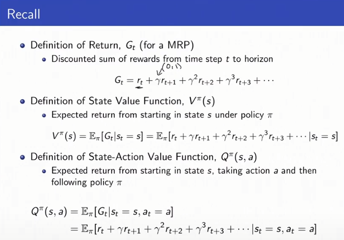
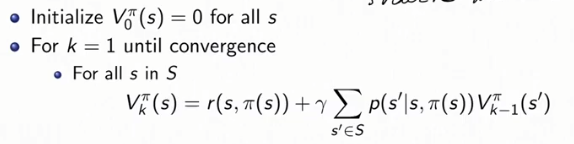
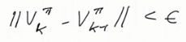
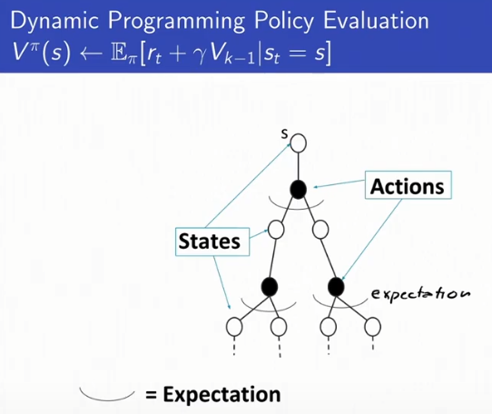
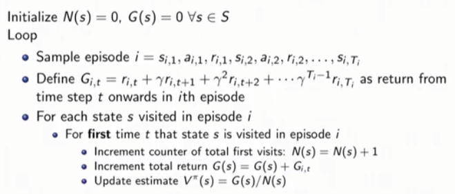
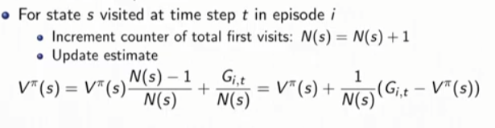

# Lec3  - Model-Free Policy Evaluation
## Policy Evaluation
### [Note]
#### - Recall 
이전 강의에서는 model이 주어진 경우에 대해서 배웠다. 
return : $G_t$ 
state value function : $V^\pi(s)$ 
state-action value function : $Q^\pi(s,a)$ $\rightarrow$ Poliy improvement에 사용가능하다.  

#### - Dynamic Programming for Policy Evaluation 
Policy Evaluation은 policy가 주어졌을 때, 그 policy의 expected discounted sum of rewards가 무엇인지 파악해서 policy가 얼마나 좋은지 평가하는 것이다. dynamics(= transition model)와 reward model이 주어졌을 때, dynamic programming방법을 통해 policy를 평가할 수 있다.

$V^\pi_k(s)$ : policy $\pi$에서 k번 반복했을 때 state의 값이다.
만약, k가 큰 숫자라면 무한번 반복했을 때와 비슷한 state 추정값이라고 볼 수 있다.  

#### - Schematic Approach 
$V^\pi(s) \leftarrow E_\pi[r_t+\gamma V_{k-1}|s_t=s]$ 
여기서 $E$의 의미는 $p(s'|s,\pi(s))$를 반영한다.  
특정 state에서 action을 취해 다른 state로 이동하면서 trajectory tree를 그릴 수 있다. 

Dynamic Programming이 하는 것은 다음 state들($s'$)에 대해서 평균을 취하는 것이다. 

'bootstraping', 그림 상 tree내의 모든 하단 states들을 고려하는 것이 아니라 현재의 level에서 오직 1개의 time step 뒤의 기댓값을 계산한다. bootstrap을 위해선 최근의 observation에만 의존해도 되는, MDP 성질을 만족해야한다. dunamic programming은 모델 $P(s'|s,a)$ 을 알고 있기 때문에 가능하다.   

$V^\pi(s) = r(s,\pi(s)) + \gamma \sum_{s' \in S} P(s'|s,a)V^\pi_{k-1}(s')$

#### - Data의 추정치가 좋은지 판별하는 기준 
- Bias of estimator $\hat{\theta}$ :  $E_{x|\theta}[\hat{\theta}]-\theta$ 
- Variance : $Var(\hat{\theta}) = E_{x|\theta}[(\hat{\theta} -E[\hat{\theta}])^2]$ 
- MSE(Mean Squared Error) : $MSE(\hat{\theta}) = Var(\hat{\theta}) + Bias(\hat{\theta})^2$ 
<mark style='background-color: #ffdce0'> Q) $\theta$를 모르는데 어떻게 bias를 구하는가 : $\theta$를 모르고 대신 gound truth나 범위를 구한다. 실사례에서는 structual risk maximixation등 bias를 구하는 방법이 따로 존재한다. 분산 같은 경우에는 concentration quality등을 통해 계산할 수 있다.  </mark>

https://bywords.tistory.com/entry/%EB%B2%88%EC%97%AD-%EC%9C%A0%EC%B9%98%EC%9B%90%EC%83%9D%EB%8F%84-%EC%9D%B4%ED%95%B4%ED%95%A0-%EC%88%98-%EC%9E%88%EB%8A%94-biasvariance-tradeoff

## Monte Carlo Policy Evaluation
### [Note]
#### - Policy Evaluation 
Return : $G_t = r_t + \gamma r_{t+1} + \gamma^2r_{t+2} + ...$  
$V^\pi(s) = E_{[T\sim \pi}[G_t|s_t = s]$
value function은 해당 policy를 따라서 $T$만큼 이동했을 때의 기댓값이다. (Value = mean return)

Monte Carlo의 장점은 dynamics, reward model이 필요하지 않다는 것이다. $s$에서 $s'$로 이동할 transition probability를 몰라도, 여러 trajectory경험을 기반으로 평균을 취하면 된다. 
또한, Markov 성질을 만족하지 않아도 된다. bootstrap을 하지않고, 평균을 취하기 때문에 finite trajectory여야한다(episodic MDPs). 단점은 trajectory가 끝날때까지 기다려야 update가능하다. 그리고 내부에 loop가 존재하면 안되고, terminate가 있어야만 적용가능하다.  

#### - First-Visit Monte Carlo(MC) 
trajectory동안 특정 state를 처음 본 순간에만 discounted future reward(=return)를 구해서 $V^\pi(s)$를 업데이트 하는데 사용한다. trajectory내에서 방문한 state에 대해서만 update가 진행되고, 동일한 trajectory내에서 두번 이상 방문한 state들의 경우, 두번째 정보부터는 사용되지 않는다.   
$V^\pi$ estimator: unbiased estimator of true $E[G_t|s_t = s]$ : 단순히 평균을 취한 것이기 때문에 unbiased하다. 특정한 분포에 대해서 동일한 state를 한번만 샘플하게 되므로 IID추정치를 구하는 것이다. 그리고 큰 수의 법칙에 따라서 episode를 무한번 반복하면, true value로 수렴한다. (= consistent)

#### - Every-Visit MC 
매 state를 방문했을 때마다 return값을 구하고 $V^\pi(s)$를 업데이트에 사용한다. 이때, $V^\pi$ estimator는 biased하다. 특정한 분포에서 동일한 state의 return을 여러번 계산하게 된다면, return끼리는 correlated하기에 더이상 IID하지 않는다. 하지만 장점은 consistent estimator라는 것인데, 즉 여러번 반복하면 true estimate로 수렴한다. 또한 경험적으로나 직관적으로 first-visit MC보다 더 많은 데이터를 사용하기에 더 낮은 분산을 갖고있다는 것을 추론할 수 있다. 
<mark style='background-color: #ffd33d'> [질문: 왜 더 낮은 분산..? bias와 분산에 대한 이해 부족] </mark>

#### - Incremental MC 
 Incremental MC의 update식은 다음과 같다. 이동평균을 더 천천히 할 수 있다. $\alpha = 1/N(s)$이면, every-visit MC와 같아진다. $\alpha \gt 1/N(s)$ 일 경우 recent data에 더 집중하고, older data는 잊혀진다. 이는 실제 non-stationary한 domain에 유용하다. 예를 들면, 제조공장에서 시간이 지남에 따라 부품이 망가져서 dynamic model이 변할 때이다. 혹은, 추천 시스템에서도 데이터의 트랜드가 변할 때와 같다. 

<mark style='background-color: #ffdce0'> Q) 매우 낮은 빈도로 방문하게 될 state들의 경우, 부정확한 value를 갖게 되나요?  A) 매우 분산이 높은 estimator이다. 좋은 value를 갖기 위해선 수없이 반복해야하는 것이 사실이다. 반면, Alphago같은 경우 MC를 사용한 것만 봐도 최악의 값은 아닐 듯 하다.   </mark>

## Temporal Difference Learning
### [Note]
#### - TD 개요  
MC와 DP를 합친 방법으로, MC처럼 sample도 하고, DP처럼 bootstrap도 한다. 또한, model이 필요없는 model-free이다. 장점으로, episodic하거나 infinite-horizon에도 사용가능하고, trajectory가 끝날 때까지 기다릴 필요가 없다. 새로운 observation을 보자마자, $(s,a,r,s')$를 사용해서 업데이트 가능하다. 

**39m46s**